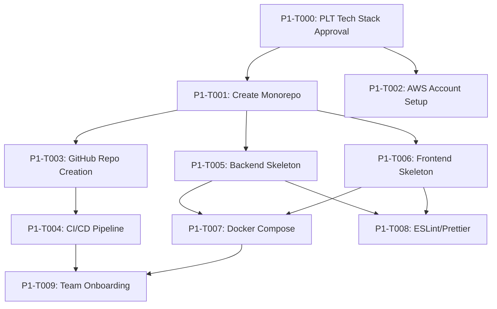
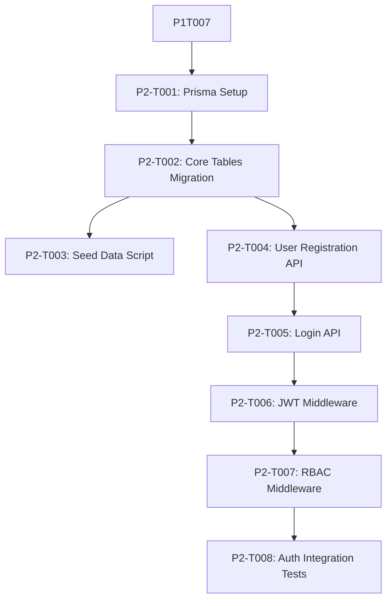

# Hephaestus-Style Board & Ticket Structure for Blueprint

**Inspired By:** [Hephaestus Framework](https://github.com/Ido-Levi/Hephaestus) workflow management
**Created:** November 6, 2025
**Purpose:** Visual board with ticket-level dependencies for AI agent execution

---

## Board Philosophy

Hephaestus uses a **ticket-driven workflow** where:
1. Each ticket is a discrete, executable unit of work
2. Tickets have **explicit dependencies** (can't start until dependencies complete)
3. **Agents autonomously select** tickets from "READY" column
4. **Validation criteria** must pass before ticket moves to "DONE"
5. **Board visualization** shows workflow bottlenecks in real-time

---

## Board Structure

### Columns

```
BACKLOG → BLOCKED → READY → IN_PROGRESS → VALIDATION → DONE
```

**Column Definitions:**

- **BACKLOG:** All tickets created but dependencies not met
- **BLOCKED:** Ticket ready except for external blocker (waiting on PLT decision, vendor, etc.)
- **READY:** All dependencies met, agent can pick up
- **IN_PROGRESS:** Agent actively working on ticket
- **VALIDATION:** Implementation complete, running validation checks
- **DONE:** All validation passed, ticket complete

### Swimlanes (Phases)

Each phase gets a swimlane:

```
┌─────────────────────────────────────────────────────────────┐
│ PHASE 1: Foundation (Days 1-14)                            │
├─────────────────────────────────────────────────────────────┤
│ PHASE 2: Core Data Model & Auth (Days 15-30)               │
├─────────────────────────────────────────────────────────────┤
│ PHASE 3: Contacts & Tasks (Days 31-60)                     │
├─────────────────────────────────────────────────────────────┤
│ PHASE 4: Feasibility & Projects (Days 61-90)               │
└─────────────────────────────────────────────────────────────┘
```

---

## Ticket Template

Every ticket follows this structure:

```yaml
ticket_id: "P1-T001"
title: "Create monorepo structure"
phase: "Phase 1: Foundation"
epic: "E1: Foundation Setup"
assignee: "agent_devops"  # or "human_tech_lead"
status: "READY"
story_points: 3
priority: "P0"  # P0 = Critical, P1 = High, P2 = Medium, P3 = Low

description: |
  Initialize monorepo with backend, frontend, and shared packages.
  Set up package.json workspaces and lerna/nx for monorepo management.

acceptance_criteria:
  - "Monorepo structure matches REPOSITORY_SETUP_GUIDE.md"
  - "npm install works at root and in all packages"
  - "npm run dev starts both backend and frontend"
  - "Lerna/nx can run commands across all packages"

dependencies:
  required:
    - "P1-T000"  # Tech stack decisions approved
  optional: []

validation:
  automated:
    - command: "npm install"
      expected: "exit code 0"
    - command: "npm run build"
      expected: "exit code 0, no TypeScript errors"
  manual:
    - "Tech Lead reviews directory structure"
    - "3 developers confirm can clone and run locally"

agent_instructions: |
  1. Read docs/project/REPOSITORY_SETUP_GUIDE.md
  2. Execute bash script from section "Monorepo Initialization"
  3. Verify all packages install without errors
  4. Create README.md with Quick Start instructions
  5. Run validation commands
  6. Create PR and request tech lead review

estimated_duration: "4 hours"
actual_duration: null
blockers: []
notes: []
```

---

## Phase 1 Tickets with Dependencies

### Phase 1: Foundation (Days 1-14)

#### Ticket Dependency Graph



#### Ticket Details

**P1-T000: PLT Tech Stack Approval**
```yaml
ticket_id: "P1-T000"
title: "PLT reviews and approves tech stack decisions"
phase: "Phase 1"
epic: "E1: Foundation Setup"
assignee: "human_plt"
status: "READY"
story_points: 0  # Not dev work
priority: "P0"

description: |
  PLT reviews TECH_STACK_DECISIONS.md and votes on recommendations:
  - Cloud Provider: AWS
  - Backend: Node.js + TypeScript + Fastify
  - Frontend: React + TypeScript + Vite
  - Database: PostgreSQL + Prisma
  - Cache: Redis

acceptance_criteria:
  - "≥3 PLT members vote"
  - "Majority approval (>50%) required"
  - "Decision logged in TECH_STACK_DECISIONS.md with signatures"
  - "Override process defined if vote is split"

dependencies:
  required: []

validation:
  manual:
    - "TECH_STACK_DECISIONS.md has 'APPROVED' status"
    - "Signatures from PLT members recorded"

estimated_duration: "90 minutes (PLT meeting)"
blockers:
  - type: "human_decision"
    description: "Requires PLT meeting to be scheduled"
```

**P1-T001: Create Monorepo Structure**
```yaml
ticket_id: "P1-T001"
title: "Initialize monorepo with backend, frontend, shared packages"
phase: "Phase 1"
epic: "E1: Foundation Setup"
assignee: "agent_devops"
status: "BACKLOG"  # Waiting on P1-T000
story_points: 3
priority: "P0"

description: |
  Create monorepo structure using npm workspaces or Lerna.
  Set up package.json at root and in backend/frontend directories.

acceptance_criteria:
  - "Directory structure matches REPOSITORY_SETUP_GUIDE.md"
  - "npm install at root installs all workspace dependencies"
  - "npm run dev:backend and npm run dev:frontend work"
  - "Shared types package created (optional)"

dependencies:
  required:
    - "P1-T000"  # Tech stack must be approved first

validation:
  automated:
    - command: "npm install"
      expected: "exit code 0"
    - command: "npm run lint"
      expected: "exit code 0"
  manual:
    - "Tech Lead reviews package.json structure"

agent_instructions: |
  1. Read docs/project/REPOSITORY_SETUP_GUIDE.md lines 50-150
  2. Create directory structure:
     connect-2.0/
     ├── backend/
     ├── frontend/
     ├── shared/
     └── package.json (root)
  3. Initialize each package with package.json
  4. Configure npm workspaces in root package.json
  5. Add base dependencies (typescript, eslint, prettier)
  6. Verify with validation commands

estimated_duration: "4 hours"
```

**P1-T002: AWS Account Setup**
```yaml
ticket_id: "P1-T002"
title: "Provision AWS accounts (dev, staging, prod)"
phase: "Phase 1"
epic: "E1: Foundation Setup"
assignee: "human_devops"
status: "BACKLOG"
story_points: 5
priority: "P0"

description: |
  Create AWS account structure:
  - Dev account (development environment)
  - Staging account (pre-production testing)
  - Prod account (production)

  Set up IAM roles, VPCs, and base infrastructure.

acceptance_criteria:
  - "3 AWS accounts created via AWS Organizations"
  - "VPCs configured in us-west-2 (Seattle region)"
  - "IAM roles created for developers (read-only prod)"
  - "RDS PostgreSQL instances provisioned (dev, staging)"
  - "S3 buckets created for document storage"
  - "ElastiCache Redis instances provisioned"

dependencies:
  required:
    - "P1-T000"  # AWS choice approved

validation:
  automated:
    - command: "aws sts get-caller-identity --profile connect-dev"
      expected: "Returns account ID"
    - command: "aws rds describe-db-instances --profile connect-dev"
      expected: "Lists PostgreSQL instance"
  manual:
    - "DevOps lead confirms IAM roles correct"
    - "Security team reviews VPC configuration"

estimated_duration: "2 days"
blockers:
  - type: "external"
    description: "Requires AWS account creation approval from finance"
```

**P1-T003: GitHub Repository Creation**
```yaml
ticket_id: "P1-T003"
title: "Create GitHub repository and configure settings"
phase: "Phase 1"
epic: "E1: Foundation Setup"
assignee: "agent_devops"
status: "BACKLOG"
story_points: 2
priority: "P0"

description: |
  Create GitHub repository at github.com/datapage/connect-2.0
  Configure branch protection, required reviews, and permissions.

acceptance_criteria:
  - "Repository created (private)"
  - "Main branch protected (require PR, 1 approval)"
  - "CODEOWNERS file created"
  - "Branch naming convention documented in CONTRIBUTING.md"
  - "Issue templates created (bug, feature, task)"
  - "PR template created with DoD checklist"

dependencies:
  required:
    - "P1-T001"  # Monorepo structure exists to push

validation:
  automated:
    - command: "git push origin main"
      expected: "Rejected (branch protected)"
    - command: "gh repo view datapage/connect-2.0 --json name"
      expected: "Returns repository name"
  manual:
    - "Tech Lead confirms branch protection rules active"

agent_instructions: |
  1. Read REPOSITORY_SETUP_GUIDE.md section "GitHub Setup"
  2. Use gh CLI: gh repo create datapage/connect-2.0 --private
  3. Create .github/ISSUE_TEMPLATE/ with templates
  4. Create .github/pull_request_template.md
  5. Create CODEOWNERS file
  6. Configure branch protection via gh CLI or UI
  7. Push monorepo structure from P1-T001

estimated_duration: "3 hours"
```

**P1-T004: CI/CD Pipeline Setup**
```yaml
ticket_id: "P1-T004"
title: "Create GitHub Actions CI/CD workflows"
phase: "Phase 1"
epic: "E1: Foundation Setup"
assignee: "agent_devops"
status: "BACKLOG"
story_points: 8
priority: "P0"

description: |
  Create 3 GitHub Actions workflows:
  1. CI Pipeline (lint, test, build on all PRs)
  2. Staging Deploy (deploy to staging on merge to main)
  3. Production Deploy (manual trigger with approval)

acceptance_criteria:
  - ".github/workflows/ci.yml runs on all PRs"
  - "CI fails if linting errors or test failures"
  - "Staging deploy workflow works (manual trigger initially)"
  - "Prod deploy requires manual approval from 2 PLT members"
  - "Slack notifications sent on build success/failure"
  - "Docker images built and pushed to ECR"

dependencies:
  required:
    - "P1-T003"  # GitHub repo exists
    - "P1-T002"  # AWS accounts ready for deploy targets

validation:
  automated:
    - "Create dummy PR, verify CI runs and passes"
    - "Trigger staging deploy, verify succeeds"
  manual:
    - "DevOps lead reviews workflow configurations"
    - "Test Slack notifications received"

agent_instructions: |
  1. Read REPOSITORY_SETUP_GUIDE.md section "CI/CD Workflows"
  2. Create .github/workflows/ci.yml:
     - Checkout code
     - Install dependencies (npm install)
     - Run linting (npm run lint)
     - Run tests (npm run test)
     - Build (npm run build)
  3. Create .github/workflows/deploy-staging.yml:
     - Build Docker images
     - Push to AWS ECR
     - Deploy to ECS (staging)
  4. Create .github/workflows/deploy-prod.yml:
     - Require manual approval (environment protection)
     - Deploy to ECS (prod)
  5. Add Slack webhook notifications

estimated_duration: "1 day"
```

**P1-T005: Backend Skeleton Setup**
```yaml
ticket_id: "P1-T005"
title: "Initialize backend project (Fastify + TypeScript)"
phase: "Phase 1"
epic: "E1: Foundation Setup"
assignee: "agent_backend"
status: "BACKLOG"
story_points: 5
priority: "P0"

description: |
  Set up backend skeleton with:
  - Fastify server
  - TypeScript configuration
  - Basic routing structure
  - Health check endpoint
  - Logger (Pino)

acceptance_criteria:
  - "Backend starts with 'npm run dev' on port 3000"
  - "GET /health returns 200 OK"
  - "GET /api/v1/hello returns 'Hello World'"
  - "TypeScript strict mode enabled"
  - "Hot reload working (nodemon)"
  - "Logger writing to console in dev, file in prod"

dependencies:
  required:
    - "P1-T001"  # Monorepo structure exists

validation:
  automated:
    - command: "cd backend && npm run dev &"
      expected: "Server starts without errors"
    - command: "curl http://localhost:3000/health"
      expected: '{"status":"ok"}'
  manual:
    - "Backend Lead reviews project structure"

agent_instructions: |
  1. cd backend/
  2. npm init -y
  3. npm install fastify @fastify/cors pino
  4. npm install -D typescript @types/node nodemon ts-node
  5. Create tsconfig.json (strict mode)
  6. Create src/index.ts with Fastify server
  7. Create src/routes/health.ts
  8. Add scripts to package.json (dev, build, start)
  9. Test with validation commands

estimated_duration: "4 hours"
```

**P1-T006: Frontend Skeleton Setup**
```yaml
ticket_id: "P1-T006"
title: "Initialize frontend project (React + Vite)"
phase: "Phase 1"
epic: "E1: Foundation Setup"
assignee: "agent_frontend"
status: "BACKLOG"
story_points: 5
priority: "P0"

description: |
  Set up frontend skeleton with:
  - React 18 + TypeScript
  - Vite build tool
  - React Router
  - Basic component structure
  - Tailwind CSS (or Material-UI)

acceptance_criteria:
  - "Frontend starts with 'npm run dev' on port 5173"
  - "Home page renders with 'Welcome to Connect 2.0'"
  - "React Router working (/login, /dashboard routes)"
  - "TypeScript strict mode enabled"
  - "Hot module replacement working"
  - "Build produces optimized bundle"

dependencies:
  required:
    - "P1-T001"  # Monorepo structure exists

validation:
  automated:
    - command: "cd frontend && npm run dev &"
      expected: "Dev server starts on port 5173"
    - command: "curl http://localhost:5173"
      expected: "Returns HTML with React app"
  manual:
    - "Frontend Lead reviews project structure"
    - "Designer reviews component library choice"

agent_instructions: |
  1. cd frontend/
  2. npm create vite@latest . -- --template react-ts
  3. npm install react-router-dom
  4. npm install -D tailwindcss postcss autoprefixer
  5. npx tailwindcss init -p
  6. Create src/pages/ directory with Home.tsx, Login.tsx
  7. Set up React Router in src/App.tsx
  8. Create basic layout component
  9. Test with validation commands

estimated_duration: "4 hours"
```

**P1-T007: Docker Compose Setup**
```yaml
ticket_id: "P1-T007"
title: "Create Docker Compose for local development"
phase: "Phase 1"
epic: "E1: Foundation Setup"
assignee: "agent_devops"
status: "BACKLOG"
story_points: 5
priority: "P0"

description: |
  Create docker-compose.yml for local development with:
  - PostgreSQL
  - Redis
  - Backend service
  - Frontend service

acceptance_criteria:
  - "docker-compose up starts all services"
  - "PostgreSQL accessible at localhost:5432"
  - "Redis accessible at localhost:6379"
  - "Backend API accessible at localhost:3000"
  - "Frontend UI accessible at localhost:5173"
  - "Services auto-restart on code changes (volumes mounted)"

dependencies:
  required:
    - "P1-T005"  # Backend skeleton exists
    - "P1-T006"  # Frontend skeleton exists

validation:
  automated:
    - command: "docker-compose up -d"
      expected: "All services healthy"
    - command: "docker-compose ps"
      expected: "4 services running"
    - command: "curl http://localhost:3000/health"
      expected: '{"status":"ok"}'
  manual:
    - "Developer confirms can connect to DB and Redis"

agent_instructions: |
  1. Read ENVIRONMENT_CONFIGURATION_GUIDE.md
  2. Create docker-compose.yml at root:
     services:
       postgres:
         image: postgres:15
         ports: 5432:5432
         environment: (from .env.example)
       redis:
         image: redis:7
         ports: 6379:6379
       backend:
         build: ./backend
         ports: 3000:3000
         volumes: ./backend:/app
       frontend:
         build: ./frontend
         ports: 5173:5173
         volumes: ./frontend:/app
  3. Create backend/Dockerfile
  4. Create frontend/Dockerfile
  5. Test with validation commands

estimated_duration: "6 hours"
```

**P1-T008: Linting & Formatting Setup**
```yaml
ticket_id: "P1-T008"
title: "Configure ESLint, Prettier, Husky pre-commit hooks"
phase: "Phase 1"
epic: "E1: Foundation Setup"
assignee: "agent_devops"
status: "BACKLOG"
story_points: 3
priority: "P1"

description: |
  Set up code quality tools:
  - ESLint with TypeScript rules
  - Prettier for formatting
  - Husky + lint-staged for pre-commit hooks

acceptance_criteria:
  - "npm run lint checks all code"
  - "npm run format auto-formats all code"
  - "Pre-commit hook runs lint + format"
  - "Git commit blocked if linting errors"
  - "EditorConfig file created"

dependencies:
  required:
    - "P1-T005"  # Backend code exists
    - "P1-T006"  # Frontend code exists

validation:
  automated:
    - "Create file with linting error, verify lint fails"
    - "Run npm run format, verify file auto-formatted"
    - "Attempt commit with linting error, verify blocked"

agent_instructions: |
  1. Install: npm install -D eslint prettier husky lint-staged
  2. Create .eslintrc.json with TypeScript rules
  3. Create .prettierrc.json with formatting rules
  4. Create .editorconfig
  5. Add husky pre-commit hook: npx husky install
  6. Configure lint-staged in package.json
  7. Test pre-commit hook

estimated_duration: "3 hours"
```

**P1-T009: Team Onboarding**
```yaml
ticket_id: "P1-T009"
title: "Onboard team members to development environment"
phase: "Phase 1"
epic: "E1: Foundation Setup"
assignee: "human_tech_lead"
status: "BACKLOG"
story_points: 3
priority: "P0"

description: |
  Walk all team members through QUICK_START.md:
  - Clone repository
  - Install dependencies
  - Run local development environment
  - Make first commit

acceptance_criteria:
  - "100% of developers (6-8 people) complete QUICK_START.md"
  - "Each developer makes ≥1 commit to main (via PR)"
  - "Each developer can run backend and frontend locally"
  - "Slack channels active (#connect-dev, #connect-standup)"
  - "GitHub permissions granted (all devs can create PRs)"

dependencies:
  required:
    - "P1-T004"  # CI/CD working
    - "P1-T007"  # Docker Compose working

validation:
  manual:
    - "Tech Lead confirms all devs completed setup"
    - "Check git log: ≥6 unique contributors"
    - "Daily standup completed in Slack"

estimated_duration: "2 days (distributed work)"
```

---

## Phase 2 Tickets (Sample)

### Phase 2: Core Data Model & Auth (Days 15-30)

#### Ticket Dependency Graph



**P2-T001: Prisma ORM Setup**
```yaml
ticket_id: "P2-T001"
title: "Configure Prisma ORM with PostgreSQL"
phase: "Phase 2"
epic: "E2: Core Data Model"
assignee: "agent_backend"
status: "BACKLOG"
story_points: 3
priority: "P0"

description: |
  Install and configure Prisma ORM:
  - Install Prisma CLI and client
  - Create schema.prisma file
  - Connect to PostgreSQL database

acceptance_criteria:
  - "Prisma schema file created at backend/prisma/schema.prisma"
  - "Database connection working (npx prisma db pull)"
  - "Prisma Client generates TypeScript types"
  - "Migration framework working (npx prisma migrate dev)"

dependencies:
  required:
    - "P1-T007"  # PostgreSQL running in Docker Compose

validation:
  automated:
    - command: "cd backend && npx prisma generate"
      expected: "Types generated successfully"
    - command: "npx prisma db push"
      expected: "Schema pushed to database"

agent_instructions: |
  1. cd backend && npm install prisma @prisma/client
  2. npx prisma init
  3. Update .env with DATABASE_URL from docker-compose
  4. Create initial schema.prisma with User model
  5. Run npx prisma migrate dev --name init
  6. Generate client: npx prisma generate

estimated_duration: "3 hours"
```

**P2-T002: Core Tables Migration**
```yaml
ticket_id: "P2-T002"
title: "Create database migration for 14 core tables"
phase: "Phase 2"
epic: "E2: Core Data Model"
assignee: "agent_backend"
status: "BACKLOG"
story_points: 8
priority: "P0"

description: |
  Implement all 14 core tables from DATABASE_SCHEMA.md:
  - projects, feasibility, tasks, entitlement
  - loans, loan_draws, inspections
  - contacts, entities, documents
  - users, plan_library
  - cycle_time_metrics, pipeline_metrics (materialized views)

acceptance_criteria:
  - "Prisma schema includes all 14 tables"
  - "All foreign keys defined with onDelete/onUpdate rules"
  - "All indexes created (see DATABASE_SCHEMA.md)"
  - "Migration runs successfully (forward and rollback)"
  - "TypeScript types auto-generated for all models"

dependencies:
  required:
    - "P2-T001"  # Prisma configured

validation:
  automated:
    - command: "npx prisma migrate dev"
      expected: "Migration applied successfully"
    - command: "npx prisma migrate reset"
      expected: "Rollback successful"
    - command: "npm run type-check"
      expected: "No TypeScript errors"

agent_instructions: |
  1. Read DATABASE_SCHEMA.md lines 1-944
  2. Translate each table to Prisma schema syntax
  3. Add all indexes (@@index directives)
  4. Add all foreign key constraints
  5. Create migration: npx prisma migrate dev --name core_schema
  6. Generate client: npx prisma generate
  7. Validate all types compile

estimated_duration: "1.5 days"
file_reference: "docs/technical/DATABASE_SCHEMA.md lines 91-815"
```

**P2-T004: User Registration API**
```yaml
ticket_id: "P2-T004"
title: "Implement POST /api/v1/auth/register endpoint"
phase: "Phase 2"
epic: "E3: Authentication"
assignee: "agent_backend"
status: "BACKLOG"
story_points: 5
priority: "P0"

description: |
  Create user registration endpoint:
  - Validate email format and password strength
  - Hash password with bcrypt
  - Create user record in database
  - Return sanitized user object (no password)

acceptance_criteria:
  - "POST /auth/register accepts email, password, name, role"
  - "Password validated: min 12 chars, 1 uppercase, 1 number, 1 special"
  - "Email validated: RFC 5322 format"
  - "Password hashed with bcrypt (cost factor 12)"
  - "Duplicate email returns 409 Conflict"
  - "Returns 201 Created with user object (no password)"

dependencies:
  required:
    - "P2-T002"  # Users table exists

validation:
  automated:
    - "Unit tests: password validation rules"
    - "Integration test: POST /auth/register succeeds"
    - "Integration test: duplicate email rejected"
    - command: "curl -X POST localhost:3000/api/v1/auth/register -d '{...}'"
      expected: "201 Created, user object returned"

agent_instructions: |
  1. Read API_SPECIFICATION.md auth endpoints section
  2. Install bcrypt: npm install bcrypt @types/bcrypt
  3. Create src/routes/auth/register.ts
  4. Implement password validation function
  5. Implement email validation function
  6. Hash password before storing
  7. Insert user into database via Prisma
  8. Write unit tests for validation functions
  9. Write integration test for endpoint

estimated_duration: "6 hours"
file_reference: "docs/technical/API_SPECIFICATION.md lines 125-150"
```

**P2-T006: JWT Authentication Middleware**
```yaml
ticket_id: "P2-T006"
title: "Create JWT authentication middleware"
phase: "Phase 2"
epic: "E3: Authentication"
assignee: "agent_backend"
status: "BACKLOG"
story_points: 5
priority: "P0"

description: |
  Create middleware to protect routes with JWT:
  - Extract JWT from Authorization header
  - Verify signature and expiration
  - Attach user object to request context
  - Return 401 Unauthorized if invalid

acceptance_criteria:
  - "Middleware extracts Bearer token from header"
  - "JWT verified using secret from .env"
  - "Expired tokens rejected with 401"
  - "Invalid signatures rejected with 401"
  - "Valid tokens attach user to request.user"
  - "Works with Fastify decorators"

dependencies:
  required:
    - "P2-T005"  # Login endpoint generates JWTs

validation:
  automated:
    - "Unit test: valid JWT passes"
    - "Unit test: expired JWT rejected"
    - "Unit test: invalid signature rejected"
    - "Integration test: protected route returns 401 without token"
    - "Integration test: protected route returns 200 with valid token"

agent_instructions: |
  1. Install jsonwebtoken: npm install jsonwebtoken @types/jsonwebtoken
  2. Create src/middleware/auth.ts
  3. Extract token from header: Authorization: Bearer <token>
  4. Verify with jwt.verify(token, process.env.JWT_SECRET)
  5. Decode payload to get user ID
  6. Fetch user from database
  7. Attach to request.user
  8. Write comprehensive tests

estimated_duration: "6 hours"
```

---

## Board Automation Rules

### Auto-Move Rules

```yaml
automation_rules:
  - trigger: "All dependencies completed"
    action: "Move ticket from BACKLOG → READY"

  - trigger: "Agent picks up ticket"
    action: "Move ticket from READY → IN_PROGRESS"
    update: "Assign ticket to agent, start timer"

  - trigger: "Agent completes implementation"
    action: "Move ticket from IN_PROGRESS → VALIDATION"
    triggers: "Run automated validation checks"

  - trigger: "All validation checks pass"
    action: "Move ticket from VALIDATION → DONE"
    triggers: "Unblock dependent tickets"

  - trigger: "Validation check fails"
    action: "Move ticket from VALIDATION → IN_PROGRESS"
    notify: "Agent who implemented ticket"

  - trigger: "External blocker identified"
    action: "Move ticket to BLOCKED column"
    notify: "Tech Lead, add blocker comment"

  - trigger: "Blocker resolved"
    action: "Move ticket from BLOCKED → READY (if deps met) or BACKLOG"
```

### Dependency Resolution

```yaml
dependency_engine:
  - "On ticket completion (status → DONE):"
    - "Find all tickets with this ticket in dependencies.required"
    - "For each dependent ticket:"
      - "Check if all required dependencies are DONE"
      - "If yes: move ticket from BACKLOG → READY"
      - "If no: keep in BACKLOG"

  - "On ticket blocked:"
    - "Find all downstream dependent tickets"
    - "Add warning label: 'upstream-blocked'"
    - "Notify assignees of dependent tickets"
```

---

## Agent Selection Algorithm

When multiple tickets are READY, how does an agent choose?

```python
def select_next_ticket(agent, ready_tickets):
    """
    Agent autonomously selects next ticket from READY column.
    """
    # Filter by agent capability
    capable_tickets = [t for t in ready_tickets if agent.can_handle(t)]

    # Score each ticket
    scored_tickets = []
    for ticket in capable_tickets:
        score = 0

        # Priority weight (P0 = 100, P1 = 75, P2 = 50, P3 = 25)
        score += ticket.priority_weight

        # Phase urgency (Phase 1 more urgent than Phase 4)
        score += (5 - ticket.phase_number) * 10

        # Unblock factor (how many tickets depend on this?)
        score += len(ticket.dependent_tickets) * 5

        # Story points (prefer smaller tickets for quick wins)
        score += (13 - ticket.story_points) * 2

        # Agent expertise match
        if ticket.epic in agent.expertise_areas:
            score += 20

        scored_tickets.append((ticket, score))

    # Sort by score descending
    scored_tickets.sort(key=lambda x: x[1], reverse=True)

    # Return highest scoring ticket
    return scored_tickets[0][0] if scored_tickets else None
```

**Example:**
- Agent: `agent_backend` with expertise in ["E2", "E3"]
- Ready Tickets:
  - P2-T001 (Prisma Setup): Priority P0, Phase 2, 0 dependents, 3 points, Epic E2
    - Score: 100 + 30 + 0 + 20 + 20 = **170**
  - P1-T008 (Linting): Priority P1, Phase 1, 2 dependents, 3 points, Epic E1
    - Score: 75 + 40 + 10 + 20 + 0 = **145**
- **Agent selects P2-T001** (higher score)

---

## Metrics Dashboard

### Real-Time Metrics

Display on the board:

```yaml
metrics:
  phase_progress:
    - phase: "Phase 1"
      total_tickets: 9
      done: 6
      in_progress: 2
      ready: 1
      blocked: 0
      backlog: 0
      completion: "67%"

  velocity:
    - week: "Week 1"
      planned_points: 20
      completed_points: 18
      velocity: "90%"

  blockers:
    - ticket: "P1-T002"
      blocker_type: "external"
      description: "Awaiting AWS account approval"
      days_blocked: 3
      assignee: "human_devops"

  agent_utilization:
    - agent: "agent_backend"
      current_ticket: "P2-T002"
      tickets_completed: 3
      points_completed: 11
      utilization: "85%"

  cycle_time:
    - metric: "Average time from READY → DONE"
      value: "18 hours"
      target: "< 24 hours"
      status: "✅ On track"
```

### Critical Path View

Highlight the critical path (longest dependency chain):

```
Critical Path (28 points, 12 days estimated):
P1-T000 (0) → P1-T001 (3) → P1-T005 (5) → P2-T001 (3) → P2-T002 (8) → P2-T004 (5) → P2-T006 (5)

If any ticket on critical path is blocked, flag as HIGH PRIORITY.
```

---

## GitHub Project Board Configuration

### How to Create This in GitHub Projects

```yaml
github_project_setup:
  board_type: "Project (Beta) - Board view"

  columns:
    - name: "Backlog"
      automation: "New issues default here"
    - name: "Blocked"
      automation: "Manual move only"
    - name: "Ready"
      automation: "Auto-move when all dependency issues closed"
    - name: "In Progress"
      automation: "Auto-move when assignee added"
    - name: "Validation"
      automation: "Auto-move when PR created"
    - name: "Done"
      automation: "Auto-move when issue closed"

  custom_fields:
    - name: "Phase"
      type: "single_select"
      options: ["Phase 1", "Phase 2", "Phase 3", "Phase 4"]

    - name: "Epic"
      type: "single_select"
      options: ["E1: Foundation", "E2: Core Data", "E3: Auth", ...]

    - name: "Story Points"
      type: "number"

    - name: "Priority"
      type: "single_select"
      options: ["P0", "P1", "P2", "P3"]

    - name: "Agent Assignee"
      type: "single_select"
      options: ["agent_backend", "agent_frontend", "agent_devops", "human"]

    - name: "Dependencies (Required)"
      type: "text"  # "P1-T000, P1-T001"

    - name: "Validation Status"
      type: "single_select"
      options: ["Not Started", "Running", "Passed", "Failed"]

  labels:
    - "phase:1" (blue)
    - "phase:2" (green)
    - "epic:E1" (purple)
    - "epic:E2" (purple)
    - "priority:P0" (red)
    - "blocked:external" (orange)
    - "type:backend" (gray)
    - "type:frontend" (gray)

  views:
    - name: "Board View"
      type: "board"
      group_by: "Status"

    - name: "Phase 1 Sprint"
      type: "table"
      filter: "phase:1"

    - name: "Ready to Work"
      type: "table"
      filter: "status:Ready"
      sort: "Priority descending"

    - name: "Blockers"
      type: "table"
      filter: "status:Blocked"

    - name: "Critical Path"
      type: "roadmap"
      show: "Only tickets on critical path"
```

### Python Script to Import Tickets

```python
import subprocess
import yaml

# Load ticket definitions from YAML
with open('tickets.yaml') as f:
    tickets = yaml.safe_load(f)

for ticket in tickets:
    # Create GitHub issue
    title = f"[{ticket['ticket_id']}] {ticket['title']}"
    body = f"""
## Description
{ticket['description']}

## Acceptance Criteria
{chr(10).join(['- [ ] ' + c for c in ticket['acceptance_criteria']])}

## Dependencies
Required: {', '.join(ticket['dependencies']['required'])}

## Agent Instructions
{ticket['agent_instructions']}

## Validation
{yaml.dump(ticket['validation'])}
"""

    # Build labels
    labels = [
        f"phase:{ticket['phase'].split()[1]}",
        f"epic:{ticket['epic'].split(':')[0]}",
        f"priority:{ticket['priority']}"
    ]

    # Create issue via GitHub CLI
    cmd = [
        'gh', 'issue', 'create',
        '--title', title,
        '--body', body,
        '--label', ','.join(labels),
        '--project', 'Connect 2.0',
        '--assignee', ticket['assignee']
    ]

    result = subprocess.run(cmd, capture_output=True, text=True)
    issue_url = result.stdout.strip()

    print(f"✅ Created {ticket['ticket_id']}: {issue_url}")

    # Set custom fields via GitHub API
    # (Field setting requires GraphQL API calls)
```

---

## Next Steps

1. **Create `tickets.yaml`** with all Phase 1-4 tickets (200+ tickets)
2. **Import to GitHub Projects** using Python script
3. **Configure board automation** (dependencies, auto-move rules)
4. **Launch Phase 1** - Agents start picking tickets from READY column
5. **Monitor metrics** - Track velocity, cycle time, blockers

---

## Example: Full Ticket YAML File Structure

```yaml
tickets:
  - ticket_id: "P1-T000"
    title: "PLT reviews and approves tech stack decisions"
    phase: "Phase 1"
    epic: "E1: Foundation Setup"
    assignee: "human_plt"
    status: "READY"
    story_points: 0
    priority: "P0"
    description: "PLT reviews TECH_STACK_DECISIONS.md..."
    acceptance_criteria:
      - "≥3 PLT members vote"
      - "Majority approval required"
    dependencies:
      required: []
      optional: []
    validation:
      automated: []
      manual:
        - "TECH_STACK_DECISIONS.md has APPROVED status"
    agent_instructions: "N/A (human decision)"
    estimated_duration: "90 minutes"
    blockers: []

  - ticket_id: "P1-T001"
    title: "Initialize monorepo with backend, frontend, shared packages"
    # ... (full ticket definition)

  # ... 200+ more tickets
```

---

**Status:** Ready for Ticket Generation
**Next Action:** Generate full `tickets.yaml` with all Phase 1-4 tickets?
**Estimated Work:** ~3 hours to create comprehensive ticket definitions
