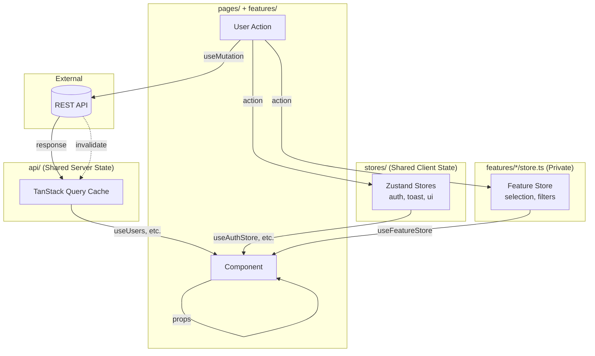

# React Frontend Architecture 

---

## Purpose


---

## Tech Stack Overview

| Layer | Technology | Version Policy |
|-------|------------|----------------|
| Framework | React | Latest stable (currently 18.x) |
| Language | TypeScript | Strict mode enabled |
| Styling | CSS Modules | Co-located with components |
| Build | Vite | Latest stable |
| Client State | Zustand | Minimal, surgical stores |
| Server State | TanStack Query | All async data |
| Routing | React Router | v6+ |
| HTTP Client | Axios or ky | Wrapped in custom client |
| Testing | Vitest + RTL + Playwright | Unit, integration, E2E |
| Linting | ESLint + Prettier | Shared config package |

---

## Project Structure

```
src/
├── app/                    # Application shell
│   ├── App.tsx
│   ├── routes.tsx          # Route definitions
│   └── providers.tsx       # QueryClientProvider only
│
├── pages/                  # Route entry points
│   ├── LoginPage.tsx
│   ├── DashboardPage.tsx
│   ├── SettingsPage.tsx
│   ├── NotFoundPage.tsx
│   └── index.ts            # Barrel export
│
├── api/                    # Shared server state (TanStack Query)
│   └── [domain]/           # e.g., users/, products/, orders/
│       ├── queries.ts      # useUsers, useUser, etc.
│       ├── mutations.ts    # useCreateUser, useDeleteUser, etc.
│       ├── keys.ts         # Query key factory
│       ├── types.ts        # Domain types
│       └── index.ts        # Public exports
│
├── stores/                 # Shared client state (Zustand)
│   ├── auth.store.ts       # User session, permissions
│   ├── ui.store.ts         # Theme, sidebar, global modals
│   ├── toast.store.ts      # Toast notifications
│   └── index.ts            # Barrel export
│
├── features/               # UI features (isolated)
│   └── [feature-name]/
│       ├── components/     # Feature-specific components
│       ├── hooks/          # Feature-specific hooks
│       ├── store.ts        # PRIVATE client state (if needed)
│       └── index.ts        # Public exports (components only)
│
├── components/             # Shared UI components
│   ├── ui/                 # Primitives (Button, Input, Modal)
│   └── common/             # Composed components (DataTable, SearchBar)
│
├── hooks/                  # Shared custom hooks
├── lib/                    # Utilities and helpers
│   ├── api-client.ts       # Configured HTTP client
│   ├── constants.ts
│   └── utils.ts
│
├── styles/                 # Global styles
│   ├── variables.css       # CSS custom properties
│   ├── reset.css
│   └── global.css
│
├── types/                  # Shared TypeScript types
│   └── common.ts
│
└── main.tsx                # Entry point
```

### Key Principles

**Separate data from UI.** Data lives in `api/` (server state) and `stores/` (client state). Features are purely UI—they consume data but don't own it. This lets multiple features share data without coupling to each other.

```
┌─────────────────────────────────────────────────────────────┐
│                         pages/                              │
└─────────────────────────────────────────────────────────────┘
        │                    │                    │
        ▼                    ▼                    ▼
┌───────────────┐    ┌───────────────┐    ┌───────────────┐
│     api/      │    │    stores/    │    │   features/   │
│ ───────────── │    │ ───────────── │    │ ───────────── │
│ Shared SERVER │    │ Shared CLIENT │    │    Private    │
│    state      │    │    state      │    │ CLIENT state  │
│ (TanStack Q)  │    │   (Zustand)   │    │   (Zustand)   │
└───────────────┘    └───────────────┘    └───────────────┘
     useUsers()       useAuthStore()       (not exported)
```

### Import Rules

| Layer | Can Import From | Cannot Import From |
|-------|-----------------|-------------------|
| `api/*` | `lib/`, `types/` | `features/*`, `pages/*`, `stores/*` |
| `stores/*` | `lib/`, `types/` | `features/*`, `pages/*`, `api/*` |
| `features/*` | `api/*`, `stores/*`, `lib/`, `components/*` | Other `features/*` |
| `pages/*` | Everything | — |

**Critical rule:** Features NEVER import from other features. They share data through `api/` and `stores/`.

```typescript
// ✅ CORRECT: Dashboard uses shared api layer
// features/dashboard/components/UserStatsCard.tsx
import { useUsers } from '@/api/users';

// ❌ WRONG: Dashboard imports from another feature
// features/dashboard/components/UserStatsCard.tsx
import { useUsers } from '@/features/user-management';  // Creates coupling!
```

**Deletability test:** Can you `rm -rf features/[name]` and only break the pages that used it? If deleting a feature breaks other features, you have a coupling problem.

**Flat over nested:** Avoid deep nesting. If you're more than 3 levels deep, reconsider the structure.

**Explicit exports:** Features export components only via `index.ts`. Private stores stay private.

### Pages

Pages are entry points and composition roots. They:
- Handle route parameters and query strings
- Set page-level layout
- Compose feature components
- Import from `api/`, `stores/`, and `features/`

Pages should **not** contain business logic—delegate to features for UI, `api/` for data.

```typescript
// pages/UsersPage.tsx
import { useUsers, useDeleteUser } from '@/api/users';     // Shared server state
import { useAuthStore } from '@/stores/auth';              // Shared client state
import { useToastStore } from '@/stores/toast';            // Shared client state
import { UserTable, BulkActions } from '@/features/user-management';
import { useUserManagementStore } from '@/features/user-management/store';  // Feature-private
import { PageLayout } from '@/components/common';

export function UsersPage() {
  // Server state
  const { data: users, isLoading } = useUsers();
  const deleteUser = useDeleteUser();

  // Shared client state
  const currentUser = useAuthStore((s) => s.user);
  const addToast = useToastStore((s) => s.add);

  // Feature-private client state
  const selectedIds = useUserManagementStore((s) => s.selectedIds);
  const clearSelection = useUserManagementStore((s) => s.clearSelection);

  const handleBulkDelete = () => {
    if (currentUser?.role !== 'admin') {
      addToast({ message: 'Only admins can delete users', type: 'error' });
      return;
    }
    selectedIds.forEach((id) => deleteUser.mutate(id));
    clearSelection();
    addToast({ message: `Deleted ${selectedIds.size} users`, type: 'success' });
  };

  if (isLoading) return <div>Loading...</div>;

  return (
    <PageLayout title="Users">
      <BulkActions selectedCount={selectedIds.size} onDelete={handleBulkDelete} />
      <UserTable users={users ?? []} />
    </PageLayout>
  );
}
```

### Routes

```typescript
// app/routes.tsx
import { createBrowserRouter, Navigate } from 'react-router-dom';
import {
  DashboardPage,
  LoginPage,
  SettingsPage,
  NotFoundPage
} from '@/pages';
import { ProtectedRoute } from '@/features/auth';

export const router = createBrowserRouter([
  {
    path: '/login',
    element: <LoginPage />,
  },
  {
    path: '/',
    element: <ProtectedRoute />,
    children: [
      { index: true, element: <Navigate to="/dashboard" replace /> },
      { path: 'dashboard', element: <DashboardPage /> },
      { path: 'settings', element: <SettingsPage /> },
    ],
  },
  {
    path: '*',
    element: <NotFoundPage />,
  },
]);
```

---

## State Management

We use a three-layer approach that separates shared data from feature-private UI state:

| Type | Location | Tool | Example |
|------|----------|------|---------|
| Shared server state | `api/` | TanStack Query | Users, products, orders |
| Shared client state | `stores/` | Zustand | Auth, theme, toasts |
| Feature-private client state | `features/*/store.ts` | Zustand | Selection, filters |

### Shared Server State: `api/` + TanStack Query

All data from APIs lives in `api/`. This is the single source of truth for server data. Any feature can import from here.

```typescript
// api/users/types.ts
export interface User {
  id: string;
  name: string;
  email: string;
  role: 'admin' | 'member';
  createdAt: string;
}

export interface CreateUserPayload {
  name: string;
  email: string;
  role: 'admin' | 'member';
}

export interface UserFilters {
  role?: 'admin' | 'member';
  search?: string;
}
```

```typescript
// api/users/keys.ts
import type { UserFilters } from './types';

export const userKeys = {
  all: ['users'] as const,
  lists: () => [...userKeys.all, 'list'] as const,
  list: (filters?: UserFilters) => [...userKeys.lists(), filters] as const,
  details: () => [...userKeys.all, 'detail'] as const,
  detail: (id: string) => [...userKeys.details(), id] as const,
};
```

```typescript
// api/users/queries.ts
import { useQuery } from '@tanstack/react-query';
import { apiClient } from '@/lib/api-client';
import { userKeys } from './keys';
import type { User, UserFilters } from './types';

export function useUsers(filters?: UserFilters) {
  return useQuery({
    queryKey: userKeys.list(filters),
    queryFn: async () => {
      const response = await apiClient.get<User[]>('/users', { params: filters });
      return response.data;
    },
  });
}

export function useUser(id: string) {
  return useQuery({
    queryKey: userKeys.detail(id),
    queryFn: async () => {
      const response = await apiClient.get<User>(`/users/${id}`);
      return response.data;
    },
    enabled: !!id,
  });
}
```

```typescript
// api/users/mutations.ts
import { useMutation, useQueryClient } from '@tanstack/react-query';
import { apiClient } from '@/lib/api-client';
import { userKeys } from './keys';
import type { User, CreateUserPayload } from './types';

export function useCreateUser() {
  const queryClient = useQueryClient();

  return useMutation({
    mutationFn: async (payload: CreateUserPayload) => {
      const response = await apiClient.post<User>('/users', payload);
      return response.data;
    },
    onSuccess: () => {
      queryClient.invalidateQueries({ queryKey: userKeys.lists() });
    },
  });
}

export function useDeleteUser() {
  const queryClient = useQueryClient();

  return useMutation({
    mutationFn: async (id: string) => {
      await apiClient.delete(`/users/${id}`);
      return id;
    },
    onSuccess: () => {
      queryClient.invalidateQueries({ queryKey: userKeys.all });
    },
  });
}
```

```typescript
// api/users/index.ts
export type { User, CreateUserPayload, UserFilters } from './types';
export { userKeys } from './keys';
export { useUsers, useUser } from './queries';
export { useCreateUser, useDeleteUser } from './mutations';
```

**Cache sharing:** Multiple features calling `useUsers()` share the same cache automatically. When one feature creates a user, all features see the update.

### Shared Client State: `stores/` + Zustand

Client state that multiple features need lives in `stores/`. These are global singletons—no Provider required.

```typescript
// stores/auth.store.ts
import { create } from 'zustand';
import { persist } from 'zustand/middleware';

interface User {
  id: string;
  name: string;
  role: 'admin' | 'member';
}

interface AuthState {
  user: User | null;
  token: string | null;
  setAuth: (user: User, token: string) => void;
  logout: () => void;
}

export const useAuthStore = create<AuthState>()(
  persist(
    (set) => ({
      user: null,
      token: null,
      setAuth: (user, token) => set({ user, token }),
      logout: () => set({ user: null, token: null }),
    }),
    { name: 'auth' }
  )
);
```

```typescript
// stores/toast.store.ts
import { create } from 'zustand';

interface Toast {
  id: string;
  message: string;
  type: 'success' | 'error' | 'info';
}

interface ToastState {
  toasts: Toast[];
  add: (toast: Omit<Toast, 'id'>) => void;
  dismiss: (id: string) => void;
}

export const useToastStore = create<ToastState>((set) => ({
  toasts: [],
  add: (toast) =>
    set((s) => ({
      toasts: [...s.toasts, { ...toast, id: crypto.randomUUID() }],
    })),
  dismiss: (id) =>
    set((s) => ({ toasts: s.toasts.filter((t) => t.id !== id) })),
}));
```

```typescript
// stores/ui.store.ts
import { create } from 'zustand';
import { persist } from 'zustand/middleware';

interface UIState {
  sidebarOpen: boolean;
  theme: 'light' | 'dark' | 'system';
  toggleSidebar: () => void;
  setTheme: (theme: UIState['theme']) => void;
}

export const useUIStore = create<UIState>()(
  persist(
    (set) => ({
      sidebarOpen: true,
      theme: 'system',
      toggleSidebar: () => set((s) => ({ sidebarOpen: !s.sidebarOpen })),
      setTheme: (theme) => set({ theme }),
    }),
    { name: 'ui-preferences' }
  )
);
```

### Feature-Private Client State: `features/*/store.ts`

UI state that only one feature needs stays private in that feature. **Never export this from `index.ts`** for other features to use.

```typescript
// features/user-management/store.ts
import { create } from 'zustand';

// PRIVATE - only used within user-management feature
interface UserManagementState {
  selectedIds: Set<string>;
  isFilterPanelOpen: boolean;
  toggleSelectUser: (id: string) => void;
  selectAll: (ids: string[]) => void;
  clearSelection: () => void;
  toggleFilterPanel: () => void;
}

export const useUserManagementStore = create<UserManagementState>((set) => ({
  selectedIds: new Set(),
  isFilterPanelOpen: false,

  toggleSelectUser: (id) =>
    set((state) => {
      const next = new Set(state.selectedIds);
      next.has(id) ? next.delete(id) : next.add(id);
      return { selectedIds: next };
    }),

  selectAll: (ids) => set({ selectedIds: new Set(ids) }),
  clearSelection: () => set({ selectedIds: new Set() }),
  toggleFilterPanel: () =>
    set((state) => ({ isFilterPanelOpen: !state.isFilterPanelOpen })),
}));
```

```typescript
// features/user-management/index.ts
// Export components ONLY - not the store
export { UserTable } from './components/UserTable';
export { UserFilters } from './components/UserFilters';
export { BulkActions } from './components/BulkActions';
```

### When to Use What

| Scenario | Location | Tool |
|----------|----------|------|
| Data from API | `api/` | TanStack Query |
| Auth state (user, token) | `stores/` | Zustand |
| Theme, sidebar, toasts | `stores/` | Zustand |
| Feature-local selection | `features/*/store.ts` | Zustand |
| Feature-local filters | `features/*/store.ts` | Zustand |
| Form state | Component-local | React Hook Form or useState |
| Modal open state | Component-local | useState |

---

## Data Flow Principles

Our architecture enforces **unidirectional data flow**. Data moves in one direction, making state changes predictable, debuggable, and traceable.

### Core Principle

```
Source of Truth → Derived State → UI → User Action → Back to Source
```

Never shortcut this loop. Never mutate state directly from the UI.

### System Data Flow



### Flow by State Type

#### Server State (TanStack Query)

```
┌─────────┐     ┌─────────────┐     ┌───────────┐     ┌────────────┐
│   API   │────▶│ Query Cache │────▶│ Component │────▶│  UI Render │
└─────────┘     └─────────────┘     └───────────┘     └────────────┘
     ▲                                    │
     │                                    │ User clicks "Save"
     │                                    ▼
     │               ┌─────────────────────────────┐
     └───────────────│  useMutation → API call     │
                     │  onSuccess → invalidate     │
                     └─────────────────────────────┘
```

Data flows:
1. Component subscribes to cache via `useQuery`
2. User triggers action
3. `useMutation` sends request to API
4. On success, cache invalidates
5. Affected queries refetch
6. Components re-render with new data

#### Client State (Zustand)

```
┌─────────────┐     ┌───────────┐     ┌────────────┐
│ Zustand     │────▶│ Component │────▶│  UI Render │
│ Store       │     │ (selector)│     │            │
└─────────────┘     └───────────┘     └────────────┘
       ▲                  │
       │                  │ User clicks "Toggle Sidebar"
       │                  ▼
       │         ┌─────────────────┐
       └─────────│ store.action()  │
                 └─────────────────┘
```

Data flows:
1. Component subscribes via selector: `useStore((s) => s.sidebarOpen)`
2. User triggers action
3. Component calls store action
4. Store updates immutably
5. Subscribed components re-render

#### Component Props

```
┌──────────────┐
│    Parent    │
└──────┬───────┘
       │ props (data down)
       ▼
┌──────────────┐
│    Child     │
└──────┬───────┘
       │ callback (events up)
       ▼
┌──────────────┐
│  Grandchild  │
└──────────────┘
```

Data flows down via props. Events flow up via callbacks. Never the reverse.

### The Golden Rules

1. **Single source of truth** — Every piece of state has exactly one owner
2. **State flows down** — Parent to child via props, store to component via hooks
3. **Events flow up** — Child notifies parent via callbacks, component notifies store via actions
4. **Immutable updates** — Never mutate state directly; always create new references
5. **Derive, don't duplicate** — If you can compute it from existing state, don't store it separately

### Anti-Patterns to Avoid

#### ❌ Direct Cache Manipulation

```typescript
// WRONG: Directly mutating query cache data
const { data } = useQuery({ queryKey: ['users'], queryFn: fetchUsers });

function handleDelete(id: string) {
  // This mutates cached data directly - NEVER DO THIS
  data.users = data.users.filter(u => u.id !== id);
}
```

```typescript
// CORRECT: Use mutation with cache invalidation
const deleteMutation = useMutation({
  mutationFn: (id: string) => apiClient.delete(`/users/${id}`),
  onSuccess: () => {
    queryClient.invalidateQueries({ queryKey: ['users'] });
  },
});

function handleDelete(id: string) {
  deleteMutation.mutate(id);
}
```

#### ❌ Child Modifying Parent State

```typescript
// WRONG: Child reaches up and modifies parent state
function ChildComponent({ parentState, setParentState }) {
  useEffect(() => {
    // Side effect that modifies parent - creates unpredictable flow
    setParentState(prev => ({ ...prev, childMounted: true }));
  }, []);
}
```

```typescript
// CORRECT: Child emits event, parent decides what to do
function ChildComponent({ onMount }) {
  useEffect(() => {
    onMount?.();
  }, [onMount]);
}

function ParentComponent() {
  const handleChildMount = useCallback(() => {
    // Parent controls its own state
    setState(prev => ({ ...prev, childMounted: true }));
  }, []);

  return <ChildComponent onMount={handleChildMount} />;
}
```

#### ❌ Prop Drilling Through Many Layers

```typescript
// WRONG: Drilling props through 5+ components
<App user={user}>
  <Layout user={user}>
    <Sidebar user={user}>
      <Navigation user={user}>
        <UserMenu user={user} />  // Finally used here
      </Navigation>
    </Sidebar>
  </Layout>
</App>
```

```typescript
// CORRECT: Use Zustand for cross-cutting state
// stores/auth.store.ts
const useAuthStore = create((set) => ({
  user: null,
  setUser: (user) => set({ user }),
}));

// UserMenu.tsx - access directly where needed
function UserMenu() {
  const user = useAuthStore((s) => s.user);
  return <div>{user.name}</div>;
}
```

#### ❌ Duplicating Server State Locally

```typescript
// WRONG: Copying server state into local state
function UserList() {
  const { data: users } = useQuery({ queryKey: ['users'], queryFn: fetchUsers });
  const [localUsers, setLocalUsers] = useState([]);

  useEffect(() => {
    if (users) setLocalUsers(users);  // Now you have two sources of truth
  }, [users]);

  // Bugs: localUsers can get out of sync with cache
}
```

```typescript
// CORRECT: Use the cache as the source of truth
function UserList() {
  const { data: users } = useQuery({ queryKey: ['users'], queryFn: fetchUsers });

  // Derive filtered/sorted views, don't duplicate
  const activeUsers = useMemo(
    () => users?.filter(u => u.active) ?? [],
    [users]
  );
}
```

#### ❌ Storing Derived State

```typescript
// WRONG: Storing something you can compute
const [items, setItems] = useState([]);
const [totalPrice, setTotalPrice] = useState(0);

function addItem(item) {
  setItems([...items, item]);
  setTotalPrice(totalPrice + item.price);  // Can get out of sync
}
```

```typescript
// CORRECT: Derive from source of truth
const [items, setItems] = useState([]);

const totalPrice = useMemo(
  () => items.reduce((sum, item) => sum + item.price, 0),
  [items]
);

function addItem(item) {
  setItems([...items, item]);  // totalPrice updates automatically
}
```

#### ❌ Bidirectional Data Binding

```typescript
// WRONG: Two-way binding creates circular dependencies
function ParentChild() {
  const [parentValue, setParentValue] = useState('');

  return (
    <Child
      value={parentValue}
      // Child can freely modify parent - flow is unclear
      setValue={setParentValue}
    />
  );
}
```

```typescript
// CORRECT: Controlled component with explicit event
function ParentChild() {
  const [value, setValue] = useState('');

  return (
    <Child
      value={value}
      onChange={(newValue) => {
        // Parent explicitly decides whether to accept the change
        if (isValid(newValue)) {
          setValue(newValue);
        }
      }}
    />
  );
}
```

### Debugging Data Flow Issues

When state behaves unexpectedly:

1. **Identify the source of truth** — Where should this state live?
2. **Trace the flow** — How does data get from source to the broken UI?
3. **Check for duplication** — Is the same data stored in multiple places?
4. **Verify immutability** — Are you mutating instead of replacing?
5. **Use DevTools** — React DevTools, TanStack Query DevTools, Zustand middleware

```typescript
// Add Zustand devtools for debugging
import { devtools } from 'zustand/middleware';

const useStore = create(
  devtools(
    (set) => ({
      // ... store definition
    }),
    { name: 'AppStore' }
  )
);
```

---

## API Layer

### HTTP Client Setup

Wrap your HTTP client to provide consistent error handling, auth, and typing:

```typescript
// lib/api-client.ts
import axios, { AxiosError, AxiosRequestConfig } from 'axios';

const baseClient = axios.create({
  baseURL: import.meta.env.VITE_API_URL,
  timeout: 30000,
  headers: { 'Content-Type': 'application/json' },
});

// Request interceptor for auth
baseClient.interceptors.request.use((config) => {
  const token = localStorage.getItem('auth_token');
  if (token) {
    config.headers.Authorization = `Bearer ${token}`;
  }
  return config;
});

// Response interceptor for error normalization
baseClient.interceptors.response.use(
  (response) => response,
  (error: AxiosError<{ message?: string }>) => {
    const normalized = {
      message: error.response?.data?.message ?? 'An unexpected error occurred',
      status: error.response?.status ?? 500,
      original: error,
    };
    return Promise.reject(normalized);
  }
);

export const apiClient = {
  get: <T>(url: string, config?: AxiosRequestConfig) =>
    baseClient.get<T>(url, config).then((r) => r.data),
  post: <T>(url: string, data?: unknown, config?: AxiosRequestConfig) =>
    baseClient.post<T>(url, data, config).then((r) => r.data),
  put: <T>(url: string, data?: unknown, config?: AxiosRequestConfig) =>
    baseClient.put<T>(url, data, config).then((r) => r.data),
  patch: <T>(url: string, data?: unknown, config?: AxiosRequestConfig) =>
    baseClient.patch<T>(url, data, config).then((r) => r.data),
  delete: <T>(url: string, config?: AxiosRequestConfig) =>
    baseClient.delete<T>(url, config).then((r) => r.data),
};
```

### API Response Types

Define types for all API responses. Never use `any`.

```typescript
// types/api.ts
export interface ApiResponse<T> {
  data: T;
  meta?: {
    total: number;
    page: number;
    pageSize: number;
  };
}

export interface ApiError {
  message: string;
  status: number;
  errors?: Record<string, string[]>;
}

export interface PaginationParams {
  page?: number;
  pageSize?: number;
  sort?: string;
  order?: 'asc' | 'desc';
}
```

---

## Component Architecture

### Component Categories

**UI Components** (`components/ui/`): Pure presentational primitives with no business logic. Think design system atoms.

```typescript
// components/ui/Button/Button.tsx
import { forwardRef, ButtonHTMLAttributes } from 'react';
import styles from './Button.module.css';
import clsx from 'clsx';

type Variant = 'primary' | 'secondary' | 'ghost' | 'danger';
type Size = 'sm' | 'md' | 'lg';

interface ButtonProps extends ButtonHTMLAttributes<HTMLButtonElement> {
  variant?: Variant;
  size?: Size;
  loading?: boolean;
}

export const Button = forwardRef<HTMLButtonElement, ButtonProps>(
  ({ variant = 'primary', size = 'md', loading, children, className, disabled, ...props }, ref) => (
    <button
      ref={ref}
      className={clsx(styles.button, styles[variant], styles[size], className)}
      disabled={disabled || loading}
      {...props}
    >
      {loading ? <span className={styles.spinner} /> : children}
    </button>
  )
);

Button.displayName = 'Button';
```

**Common Components** (`components/common/`): Composed from UI components, may include some logic but remain reusable.

**Feature Components** (`features/*/components/`): Business-logic-heavy, feature-specific. Not intended for reuse outside the feature.

### Component File Structure

```
Button/
├── Button.tsx           # Component implementation
├── Button.module.css    # Styles
├── Button.test.tsx      # Tests
└── index.ts             # Export
```

### Component Guidelines

1. **Props interface naming:** `ComponentNameProps`
2. **Default exports for pages, named exports for everything else**
3. **Forward refs for all interactive UI components**
4. **Use composition over props explosion**—if a component has 10+ props, break it up
5. **Co-locate styles**—one CSS module per component

---

## Styling with CSS Modules

### Why CSS Modules

- Zero runtime cost
- True CSS (use the full power of the language)
- Scoped by default
- Works everywhere with no config

### File Naming

```
Component.module.css
```

### Structure

```css
/* Button.module.css */

/* Use CSS custom properties for theming */
.button {
  --button-bg: var(--color-primary);
  --button-text: var(--color-white);

  display: inline-flex;
  align-items: center;
  justify-content: center;
  padding: var(--space-2) var(--space-4);
  font-weight: 500;
  border-radius: var(--radius-md);
  background: var(--button-bg);
  color: var(--button-text);
  transition: background 150ms ease;
}

.button:hover:not(:disabled) {
  --button-bg: var(--color-primary-dark);
}

/* Variants */
.secondary {
  --button-bg: var(--color-gray-100);
  --button-text: var(--color-gray-900);
}

.ghost {
  --button-bg: transparent;
  --button-text: var(--color-primary);
}

/* Sizes */
.sm { padding: var(--space-1) var(--space-2); font-size: 0.875rem; }
.lg { padding: var(--space-3) var(--space-6); font-size: 1.125rem; }
```

### Global Variables

```css
/* styles/variables.css */
:root {
  /* Colors */
  --color-primary: #2563eb;
  --color-primary-dark: #1d4ed8;
  --color-gray-100: #f3f4f6;
  --color-gray-900: #111827;
  --color-white: #ffffff;
  --color-danger: #dc2626;

  /* Spacing (4px base) */
  --space-1: 0.25rem;
  --space-2: 0.5rem;
  --space-3: 0.75rem;
  --space-4: 1rem;
  --space-6: 1.5rem;
  --space-8: 2rem;

  /* Radii */
  --radius-sm: 0.25rem;
  --radius-md: 0.375rem;
  --radius-lg: 0.5rem;
  --radius-full: 9999px;

  /* Shadows */
  --shadow-sm: 0 1px 2px rgba(0, 0, 0, 0.05);
  --shadow-md: 0 4px 6px rgba(0, 0, 0, 0.1);

  /* Typography */
  --font-sans: 'Inter', -apple-system, sans-serif;
  --font-mono: 'JetBrains Mono', monospace;
}
```

---

## Testing Strategy

### Testing Pyramid

```
        ╱╲
       ╱  ╲        E2E (Playwright)
      ╱────╲       Critical user journeys only
     ╱      ╲
    ╱────────╲     Integration (Vitest + RTL)
   ╱          ╲    Feature-level, API mocking
  ╱────────────╲
 ╱              ╲  Unit (Vitest)
╱────────────────╲ Utilities, hooks, pure functions
```

### Tools

| Tool | Purpose |
|------|---------|
| Vitest | Unit and integration tests (Vite-native, fast) |
| React Testing Library | Component testing |
| MSW | API mocking |
| Playwright | E2E testing |

### Test File Location

Co-locate tests with source files:

```
Button/
├── Button.tsx
├── Button.test.tsx    # Unit/integration
└── Button.module.css
```

E2E tests live separately:

```
e2e/
├── auth.spec.ts
├── checkout.spec.ts
└── fixtures/
```

### Example: Component Test

```typescript
// features/users/components/UserCard/UserCard.test.tsx
import { render, screen } from '@testing-library/react';
import userEvent from '@testing-library/user-event';
import { UserCard } from './UserCard';

const mockUser = {
  id: '1',
  name: 'Jane Doe',
  email: 'jane@example.com',
  role: 'Admin',
};

describe('UserCard', () => {
  it('renders user information', () => {
    render(<UserCard user={mockUser} />);

    expect(screen.getByText('Jane Doe')).toBeInTheDocument();
    expect(screen.getByText('jane@example.com')).toBeInTheDocument();
    expect(screen.getByText('Admin')).toBeInTheDocument();
  });

  it('calls onEdit when edit button is clicked', async () => {
    const onEdit = vi.fn();
    const user = userEvent.setup();

    render(<UserCard user={mockUser} onEdit={onEdit} />);

    await user.click(screen.getByRole('button', { name: /edit/i }));

    expect(onEdit).toHaveBeenCalledWith(mockUser.id);
  });
});
```

### Example: Hook Test with API Mocking

```typescript
// features/users/hooks/useUsers.test.tsx
import { renderHook, waitFor } from '@testing-library/react';
import { QueryClient, QueryClientProvider } from '@tanstack/react-query';
import { http, HttpResponse } from 'msw';
import { setupServer } from 'msw/node';
import { useUsers } from '../api';

const server = setupServer(
  http.get('/api/users', () => {
    return HttpResponse.json([
      { id: '1', name: 'Alice' },
      { id: '2', name: 'Bob' },
    ]);
  })
);

beforeAll(() => server.listen());
afterEach(() => server.resetHandlers());
afterAll(() => server.close());

function createWrapper() {
  const queryClient = new QueryClient({
    defaultOptions: { queries: { retry: false } },
  });
  return ({ children }: { children: React.ReactNode }) => (
    <QueryClientProvider client={queryClient}>{children}</QueryClientProvider>
  );
}

describe('useUsers', () => {
  it('fetches users successfully', async () => {
    const { result } = renderHook(() => useUsers(), { wrapper: createWrapper() });

    await waitFor(() => expect(result.current.isSuccess).toBe(true));

    expect(result.current.data).toHaveLength(2);
    expect(result.current.data?.[0].name).toBe('Alice');
  });
});
```

### Coverage Requirements

| Category | Minimum Coverage |
|----------|-----------------|
| Utilities/lib | 90% |
| Hooks | 80% |
| Components | 70% |
| Features (integration) | 60% |

---

## Build & Tooling

### Vite Configuration

```typescript
// vite.config.ts
import { defineConfig } from 'vite';
import react from '@vitejs/plugin-react';
import path from 'path';

export default defineConfig({
  plugins: [react()],
  resolve: {
    alias: {
      '@': path.resolve(__dirname, './src'),
    },
  },
  css: {
    modules: {
      localsConvention: 'camelCase',
    },
  },
  build: {
    sourcemap: true,
    rollupOptions: {
      output: {
        manualChunks: {
          vendor: ['react', 'react-dom', 'react-router-dom'],
          query: ['@tanstack/react-query'],
        },
      },
    },
  },
  server: {
    port: 3000,
    proxy: {
      '/api': {
        target: 'http://localhost:8080',
        changeOrigin: true,
      },
    },
  },
});
```

### TypeScript Configuration

```json
// tsconfig.json
{
  "compilerOptions": {
    "target": "ES2022",
    "lib": ["ES2022", "DOM", "DOM.Iterable"],
    "module": "ESNext",
    "moduleResolution": "bundler",
    "jsx": "react-jsx",
    "strict": true,
    "noUnusedLocals": true,
    "noUnusedParameters": true,
    "noFallthroughCasesInSwitch": true,
    "noUncheckedIndexedAccess": true,
    "exactOptionalPropertyTypes": true,
    "baseUrl": ".",
    "paths": {
      "@/*": ["src/*"]
    }
  },
  "include": ["src"],
  "references": [{ "path": "./tsconfig.node.json" }]
}
```

### ESLint Configuration

```javascript
// eslint.config.js
import js from '@eslint/js';
import typescript from '@typescript-eslint/eslint-plugin';
import typescriptParser from '@typescript-eslint/parser';
import react from 'eslint-plugin-react';
import reactHooks from 'eslint-plugin-react-hooks';
import jsxA11y from 'eslint-plugin-jsx-a11y';

export default [
  js.configs.recommended,
  {
    files: ['**/*.{ts,tsx}'],
    languageOptions: {
      parser: typescriptParser,
      parserOptions: {
        project: './tsconfig.json',
      },
    },
    plugins: {
      '@typescript-eslint': typescript,
      react,
      'react-hooks': reactHooks,
      'jsx-a11y': jsxA11y,
    },
    rules: {
      // TypeScript
      '@typescript-eslint/no-explicit-any': 'error',
      '@typescript-eslint/no-unused-vars': ['error', { argsIgnorePattern: '^_' }],
      '@typescript-eslint/consistent-type-imports': 'error',

      // React
      'react/prop-types': 'off',
      'react/react-in-jsx-scope': 'off',
      'react-hooks/rules-of-hooks': 'error',
      'react-hooks/exhaustive-deps': 'warn',

      // Accessibility
      'jsx-a11y/alt-text': 'error',
      'jsx-a11y/anchor-is-valid': 'error',
    },
  },
];
```

### Scripts

```json
// package.json (scripts section)
{
  "scripts": {
    "dev": "vite",
    "build": "tsc && vite build",
    "preview": "vite preview",
    "test": "vitest",
    "test:ui": "vitest --ui",
    "test:coverage": "vitest --coverage",
    "test:e2e": "playwright test",
    "lint": "eslint src --ext .ts,.tsx",
    "lint:fix": "eslint src --ext .ts,.tsx --fix",
    "format": "prettier --write src",
    "typecheck": "tsc --noEmit",
    "validate": "npm run typecheck && npm run lint && npm run test"
  }
}
```

---

## Deployment

### Docker Build (Platform-Agnostic)

Since we deploy to various client environments, we use a standardized Docker build that works anywhere:

```dockerfile
# Dockerfile
FROM node:20-alpine AS builder

WORKDIR /app

COPY package*.json ./
RUN npm ci

COPY . .
RUN npm run build

# Production image
FROM nginx:alpine

COPY --from=builder /app/dist /usr/share/nginx/html
COPY nginx.conf /etc/nginx/conf.d/default.conf

EXPOSE 80

CMD ["nginx", "-g", "daemon off;"]
```

```nginx
# nginx.conf
server {
    listen 80;
    root /usr/share/nginx/html;
    index index.html;

    # Gzip
    gzip on;
    gzip_types text/plain text/css application/json application/javascript text/xml;

    # Cache static assets
    location /assets/ {
        expires 1y;
        add_header Cache-Control "public, immutable";
    }

    # SPA fallback
    location / {
        try_files $uri $uri/ /index.html;
    }

    # Security headers
    add_header X-Frame-Options "SAMEORIGIN" always;
    add_header X-Content-Type-Options "nosniff" always;
    add_header X-XSS-Protection "1; mode=block" always;
}
```

### Environment Configuration

```typescript
// lib/env.ts
const envSchema = {
  VITE_API_URL: import.meta.env.VITE_API_URL,
  VITE_APP_ENV: import.meta.env.VITE_APP_ENV ?? 'development',
  VITE_SENTRY_DSN: import.meta.env.VITE_SENTRY_DSN,
} as const;

// Validate at startup
Object.entries(envSchema).forEach(([key, value]) => {
  if (value === undefined && !key.includes('SENTRY')) {
    console.warn(`Missing environment variable: ${key}`);
  }
});

export const env = envSchema;
```

---

## MCP Integration

Model Context Protocol servers extend AI tooling capabilities. Below are the MCPs we use and how they integrate into our workflow.

### Active MCPs

| MCP | Purpose | Setup |
|-----|---------|-------|
| **Figma** | Design-to-code context, component specs | Connect via Figma API token |
| **GitHub** | Code context, PR reviews, issue tracking | OAuth or PAT |
| **Context7** | Real-time library documentation lookup | API key |
| **Sentry** | Error context during debugging | DSN + API token |
| **Linear** | Issue tracking, sprint context | OAuth |

### Figma MCP Usage

The Figma MCP allows AI assistants to understand design context:

- Pull component specifications directly
- Reference spacing, colors, typography from design tokens
- Understand component hierarchy and naming conventions

**Best practices:**
- Name Figma components to match code component names
- Use Figma's dev mode for accurate measurements
- Keep design tokens in sync with CSS variables

### GitHub MCP Usage

- Reference open PRs and issues in conversations
- Pull recent commits for context on changes
- Understand branching strategy and PR requirements

### Context7 MCP Usage

Context7 provides up-to-date documentation for libraries:

- Get accurate API references for TanStack Query, Zustand, React Router
- Avoid outdated patterns from training data
- Check for breaking changes in recent versions

**Example prompt:** "Using Context7, show me the correct way to implement optimistic updates in TanStack Query v5"

### Recommended MCP Configuration

```json
// .cursor/mcp.json or equivalent
{
  "mcps": {
    "figma": {
      "enabled": true,
      "token": "${FIGMA_TOKEN}"
    },
    "github": {
      "enabled": true,
      "repos": ["org/frontend-*"]
    },
    "context7": {
      "enabled": true,
      "libraries": ["react", "@tanstack/react-query", "zustand", "vite"]
    },
    "sentry": {
      "enabled": true,
      "projects": ["frontend-*"]
    }
  }
}
```

---

## Performance Standards

### Core Web Vitals Targets

| Metric | Target | Measurement |
|--------|--------|-------------|
| LCP (Largest Contentful Paint) | < 2.5s | 75th percentile |
| INP (Interaction to Next Paint) | < 200ms | 75th percentile |
| CLS (Cumulative Layout Shift) | < 0.1 | 75th percentile |

### Bundle Size Budgets

| Chunk | Max Size (gzipped) |
|-------|-------------------|
| Initial JS | 150kb |
| Initial CSS | 30kb |
| Per-route chunk | 50kb |

### Performance Checklist

- [ ] Images use modern formats (WebP, AVIF) with srcset
- [ ] Above-the-fold content renders without JS where possible
- [ ] Route-based code splitting implemented
- [ ] TanStack Query configured with appropriate staleTime
- [ ] No layout shifts from loading states
- [ ] Fonts preloaded with `font-display: swap`

### Monitoring

```typescript
// lib/performance.ts
export function reportWebVitals() {
  if (typeof window === 'undefined') return;

  import('web-vitals').then(({ onCLS, onINP, onLCP }) => {
    onCLS(console.log);
    onINP(console.log);
    onLCP(console.log);

    // Send to analytics in production
    if (import.meta.env.PROD) {
      // sendToAnalytics(metric);
    }
  });
}
```

---

## Error Handling

### Error Boundary

```typescript
// components/common/ErrorBoundary/ErrorBoundary.tsx
import { Component, ReactNode } from 'react';

interface Props {
  children: ReactNode;
  fallback?: ReactNode;
}

interface State {
  hasError: boolean;
  error: Error | null;
}

export class ErrorBoundary extends Component<Props, State> {
  state: State = { hasError: false, error: null };

  static getDerivedStateFromError(error: Error): State {
    return { hasError: true, error };
  }

  componentDidCatch(error: Error, info: React.ErrorInfo) {
    // Log to error reporting service
    console.error('Error caught by boundary:', error, info);
  }

  render() {
    if (this.state.hasError) {
      return this.props.fallback ?? (
        <div role="alert">
          <h2>Something went wrong</h2>
          <button onClick={() => this.setState({ hasError: false, error: null })}>
            Try again
          </button>
        </div>
      );
    }

    return this.props.children;
  }
}
```

### TanStack Query Error Handling

```typescript
// app/providers.tsx
import { QueryClient, QueryClientProvider } from '@tanstack/react-query';
import { ReactQueryDevtools } from '@tanstack/react-query-devtools';

const queryClient = new QueryClient({
  defaultOptions: {
    queries: {
      staleTime: 1000 * 60, // 1 minute
      retry: (failureCount, error) => {
        // Don't retry on 4xx errors
        if (error instanceof Error && 'status' in error) {
          const status = (error as { status: number }).status;
          if (status >= 400 && status < 500) return false;
        }
        return failureCount < 3;
      },
    },
    mutations: {
      onError: (error) => {
        // Global mutation error handling
        console.error('Mutation failed:', error);
      },
    },
  },
});

export function Providers({ children }: { children: React.ReactNode }) {
  return (
    <QueryClientProvider client={queryClient}>
      {children}
      <ReactQueryDevtools initialIsOpen={false} />
    </QueryClientProvider>
  );
}
```

---

## Documentation Requirements

Every frontend repository must include the documentation specified in our [Repository Documentation Standards](./repository-documentation-standards.md):

- **README.md** — What, why, quick start, key commands
- **ARCHITECTURE.md** — System diagram, components, data flow, decisions
- **CLAUDE.md** — AI assistant context for the codebase
- **RUNBOOK.md** — Deploy, rollback, troubleshooting
- **ADRs** — `/docs/adr/` for significant decisions

### React-Specific CLAUDE.md Template

```markdown
# CLAUDE.md

## Project Overview
[One paragraph: what this frontend does]

## Tech Stack
- React 18 + TypeScript (strict)
- Vite build
- CSS Modules for styling
- TanStack Query for server state
- Zustand for client state
- Vitest + RTL + Playwright for testing

## Project Structure
- `src/api/` — Shared server state (TanStack Query hooks by domain)
- `src/stores/` — Shared client state (Zustand stores)
- `src/pages/` — Route entry points (LoginPage, DashboardPage, etc.)
- `src/features/` — UI features (components + private state only)
- `src/components/ui/` — Design system primitives
- `src/components/common/` — Shared composed components
- `src/lib/` — Utilities, API client, constants

## Import Rules
- `api/*` and `stores/*` are shared—any feature can import
- `features/*` NEVER import from other features
- Features share data through `api/` and `stores/`

## Key Patterns

### Adding a new page
1. Create `src/pages/[Name]Page.tsx`
2. Add route in `src/app/routes.tsx`
3. Import data from `api/`, state from `stores/`, UI from `features/`

### Adding a new API domain
1. Create `src/api/[domain]/`
2. Add `types.ts`, `keys.ts`, `queries.ts`, `mutations.ts`
3. Export from `index.ts`

### Adding a new feature
1. Create `src/features/[name]/`
2. Add `components/`, and optionally `store.ts` for private state
3. Export components only from `index.ts` (not stores)

### State management
- Server data → `api/` with TanStack Query
- Shared client state → `stores/` with Zustand
- Feature-private state → `features/*/store.ts` (not exported)
- Local UI state → useState

## Commands
```bash
npm run dev        # Start dev server
npm run build      # Production build
npm run test       # Run tests
npm run lint:fix   # Fix linting issues
npm run validate   # Full validation (types + lint + test)
```

## Gotchas
- Never import from one feature into another—use `api/` or `stores/`
- Always use the apiClient wrapper, never raw fetch/axios
- CSS modules use camelCase: styles.buttonPrimary not styles['button-primary']
- Feature stores are private—if another feature needs the data, move it to `stores/`

## Testing
- Unit tests co-located with source files
- E2E tests in `/e2e/`
- Use MSW for API mocking
```

---

## ADR Template for React Decisions

```markdown
# ADR-NNNN: [Title]

## Status
[Proposed | Accepted | Deprecated | Superseded by ADR-XXXX]

## Context
[What is the issue we're facing? What decision do we need to make?]

## Decision
[What is our decision? Be specific about the technology, pattern, or approach.]

## Consequences

### Positive
- [Benefit 1]
- [Benefit 2]

### Negative
- [Tradeoff 1]
- [Tradeoff 2]

### Neutral
- [Side effect that's neither good nor bad]

## Alternatives Considered

### [Alternative 1]
- Pros: ...
- Cons: ...
- Why rejected: ...

### [Alternative 2]
- Pros: ...
- Cons: ...
- Why rejected: ...

## References
- [Links to relevant documentation, articles, discussions]
```

---

## Quick Reference

### New Project Checklist

- [ ] Initialize with Vite React-TS template
- [ ] Configure path aliases (`@/`)
- [ ] Set up ESLint + Prettier
- [ ] Add TanStack Query + Zustand
- [ ] Configure CSS Modules with design tokens
- [ ] Set up Vitest + RTL
- [ ] Create folder structure (api, stores, pages, features, components, lib)
- [ ] Add Docker build
- [ ] Create README, ARCHITECTURE, CLAUDE.md
- [ ] Configure MCPs (Figma, GitHub, Context7)

### Common Commands

```bash
# Development
npm run dev                    # Start dev server
npm run build                  # Production build
npm run preview                # Preview production build

# Quality
npm run lint                   # Check linting
npm run lint:fix               # Fix linting issues
npm run typecheck              # Check TypeScript
npm run validate               # All checks

# Testing
npm run test                   # Run tests in watch mode
npm run test:coverage          # Coverage report
npm run test:e2e               # E2E tests
```

---

*Questions or suggestions? Open an issue in the playbook repository or bring it up in meetings.*