```
┌────────────────────────────────────────────────────────────────────────────────────────────────────────────────────────────────────────────────────────────┐
│                                                                                                                                                            │
│  THE PROPERTY IS THE CENTER - VALUE STREAMS ARE LENSES                                                                                                     │
│  ─────────────────────────────────────────────────────────                                                                                                 │
│                                                                                                                                                            │
│                                                                                                                                                            │
│                                        THE PROPERTY                                                                                                        │
│                                    ┌─────────────────┐                                                                                                     │
│                                    │                 │                                                                                                     │
│                                    │   123 Main St   │                                                                                                     │
│                                    │                 │                                                                                                     │
│                                    │   (exists as    │                                                                                                     │
│                                    │    one thing)   │                                                                                                     │
│                                    │                 │                                                                                                     │
│                                    └─────────────────┘                                                                                                     │
│                                            │                                                                                                               │
│                    ┌───────────┬───────────┼───────────┬───────────┬───────────┐                                                                           │
│                    │           │           │           │           │           │                                                                           │
│                    ▼           ▼           ▼           ▼           ▼           ▼                                                                           │
│               ┌─────────┐ ┌─────────┐ ┌─────────┐ ┌─────────┐ ┌─────────┐ ┌─────────┐                                                                       │
│               │   VS1   │ │   VS2   │ │   VS3   │ │   VS4   │ │   VS5   │ │   VS6   │                                                                       │
│               │  lens   │ │  lens   │ │  lens   │ │  lens   │ │  lens   │ │  lens   │                                                                       │
│               ├─────────┤ ├─────────┤ ├─────────┤ ├─────────┤ ├─────────┤ ├─────────┤                                                                       │
│               │    ✓    │ │    ✓    │ │    ✓    │ │   ●     │ │   ●     │ │   ○     │                                                                       │
│               │ complete│ │ complete│ │ complete│ │ active  │ │ active  │ │ locked  │                                                                       │
│               └─────────┘ └─────────┘ └─────────┘ └─────────┘ └─────────┘ └─────────┘                                                                       │
│                                                                                                                                                            │
│               Different people look through different lenses                                                                                               │
│               but they're all looking at the SAME property                                                                                                 │
│                                                                                                                                                            │
│                                                                                                                                                            │
│  ✓ = complete    ● = active/in-progress    ○ = locked (gates not satisfied)                                                                                │
│                                                                                                                                                            │
└────────────────────────────────────────────────────────────────────────────────────────────────────────────────────────────────────────────────────────────┘
```

---

## The Property Summary View (Cross-Value-Stream)

```
┌────────────────────────────────────────────────────────────────────────────────────────────────────────────────────────────────────────────────────────────┐
│                                                                                                                                                            │
│  PROPERTY SUMMARY - THE HOLISTIC VIEW                                                                                                                      │
│  ────────────────────────────────────                                                                                                                      │
│                                                                                                                                                            │
│                                                                                                                                                            │
│  ┌────────────────────────────────────────────────────────────────────────────────────────────────────────────────────────────────────────────────────┐   │
│  │                                                                                                                                                    │   │
│  │   123 MAIN ST - PROPERTY SUMMARY                                                                                                                   │   │
│  │                                                                                                                                                    │   │
│  │   ┌─────────────────────────────────────────────────────────────────────────────────────────────────────────────────────────────────────────────┐ │   │
│  │   │  VALUE STREAM PROGRESS                                                                                                                      │ │   │
│  │   │                                                                                                                                             │ │   │
│  │   │  VS1 Lead Intake        ████████████████████ Complete ✓                                                                                     │ │   │
│  │   │  VS2 Feasibility        ████████████████████ Complete ✓                                                                                     │ │   │
│  │   │  VS3 Acquisition        ████████████████████ Complete ✓                                                                                     │ │   │
│  │   │  VS4 Design             ████████████░░░░░░░░ 60% - In Progress                                                                              │ │   │
│  │   │  VS5 Underwriting       ██████░░░░░░░░░░░░░░ 30% - In Progress (parallel)                                                                   │ │   │
│  │   │  VS6 Construction       ░░░░░░░░░░░░░░░░░░░░ Locked (waiting on VS4 + VS5)                                                                  │ │   │
│  │   │  VS7 Closeout           ░░░░░░░░░░░░░░░░░░░░ Locked                                                                                         │ │   │
│  │   │                                                                                                                                             │ │   │
│  │   └─────────────────────────────────────────────────────────────────────────────────────────────────────────────────────────────────────────────┘ │   │
│  │                                                                                                                                                    │   │
│  │   ┌─────────────────────────────────────────────────────────────────────────────────────────────────────────────────────────────────────────────┐ │   │
│  │   │  MY TASKS ON THIS PROPERTY  (personalized to logged-in user)                                                                                │ │   │
│  │   │                                                                                                                                             │ │   │
│  │   │  🔶  Review Site Plan Draft (VS4) - uploaded 2 days ago                                                                                     │ │   │
│  │   │  🔶  3D Rendering needs revision feedback sent (VS4)                                                                                        │ │   │
│  │   │                                                                                                                                             │ │   │
│  │   └─────────────────────────────────────────────────────────────────────────────────────────────────────────────────────────────────────────────┘ │   │
│  │                                                                                                                                                    │   │
│  │   ┌─────────────────────────────────────────────────────────────────────────────────────────────────────────────────────────────────────────────┐ │   │
│  │   │  RECENT ACTIVITY                                                                                                                            │ │   │
│  │   │                                                                                                                                             │ │   │
│  │   │  Dec 28  Jane uploaded Site Plan Draft (VS4)                                                                                                │ │   │
│  │   │  Dec 27  Structural Calcs received from consultant (VS4)                                                                                    │ │   │
│  │   │  Dec 22  Design Manager requested revision on 3D Rendering (VS4)                                                                            │ │   │
│  │   │  Dec 20  Loan terms approved (VS5)                                                                                                          │ │   │
│  │   │                                                                                                                                             │ │   │
│  │   └─────────────────────────────────────────────────────────────────────────────────────────────────────────────────────────────────────────────┘ │   │
│  │                                                                                                                                                    │   │
│  │   ┌─────────────────────────────────────────────────────────────────────────────────────────────────────────────────────────────────────────────┐ │   │
│  │   │  KEY NOTES                                                                                                                                  │ │   │
│  │   │                                                                                                                                             │ │   │
│  │   │  📌 "Jurisdiction requires extra arborist review - tree on property line" (VS4, Dec 15)                                                     │ │   │
│  │   │  📌 "Builder prefers modern aesthetic, see reference images" (VS4, Dec 10)                                                                  │ │   │
│  │   │                                                                                                                                             │ │   │
│  │   └─────────────────────────────────────────────────────────────────────────────────────────────────────────────────────────────────────────────┘ │   │
│  │                                                                                                                                                    │   │
│  └────────────────────────────────────────────────────────────────────────────────────────────────────────────────────────────────────────────────────┘   │
│                                                                                                                                                            │
│                                                                                                                                                            │
│  This summary view could be:                                                                                                                               │
│  • A dedicated "Property Overview" page anyone with access can see                                                                                         │
│  • A header/sidebar when you're in a specific VS lens                                                                                                      │
│  • Filtered to show "My Tasks" specific to your role                                                                                                       │
│                                                                                                                                                            │
└────────────────────────────────────────────────────────────────────────────────────────────────────────────────────────────────────────────────────────────┘
```

---

## Revised Mental Model

```
┌────────────────────────────────────────────────────────────────────────────────────────────────────────────────────────────────────────────────────────────┐
│                                                                                                                                                            │
│  REVISED SIMPLIFIED MODEL                                                                                                                                  │
│  ────────────────────────                                                                                                                                  │
│                                                                                                                                                            │
│                                                                                                                                                            │
│  ┌────────────────────────────────────────────────────────────────────────────────────────────────────────────────────────────────────────────────────┐   │
│  │                                                                                                                                                    │   │
│  │   PROPERTY                                                                                                                                         │   │
│  │   ────────                                                                                                                                         │   │
│  │   • The central entity - everything else relates to it                                                                                             │   │
│  │   • Exists across the ENTIRE lifecycle (VS1 through VS7)                                                                                           │   │
│  │   • Has DOCUMENTS attached (accumulated across all value streams)                                                                                  │   │
│  │   • Has NOTES attached (accumulated across all value streams)                                                                                      │   │
│  │   • Has a STATUS for each value stream (locked / active / complete)                                                                                │   │
│  │   • Has USERS assigned to work on it (possibly different per value stream)                                                                         │   │
│  │   • Has a summary view showing progress across all value streams                                                                                   │   │
│  │                                                                                                                                                    │   │
│  │                                                                                                                                                    │   │
│  │   VALUE STREAM (the lens)                                                                                                                          │   │
│  │   ───────────────────────                                                                                                                          │   │
│  │   • A perspective/filter on the property                                                                                                           │   │
│  │   • Shows documents relevant to that stage of work                                                                                                 │   │
│  │   • Shows checklist items relevant to that stage of work                                                                                           │   │
│  │   • Has a STATUS per property: locked / active / complete                                                                                          │   │
│  │   • Unlocks when prerequisite value streams are complete (gates)                                                                                   │   │
│  │   • Different roles have access to different lenses                                                                                                │   │
│  │                                                                                                                                                    │   │
│  │                                                                                                                                                    │   │
│  │   DOCUMENT                                                                                                                                         │   │
│  │   ────────                                                                                                                                         │   │
│  │   • Belongs to a PROPERTY                                                                                                                          │   │
│  │   • Tagged with a VALUE STREAM (which lens it's primarily viewed through)                                                                          │   │
│  │   • Has a CATEGORY (floor plan, civil, structural, rendering, etc.)                                                                                │   │
│  │   • Has a STATUS (uploaded, pending review, approved, needs revision)                                                                              │   │
│  │   • Has REVIEWS attached                                                                                                                           │   │
│  │   • Visible to anyone with property access (but edit permissions vary by role)                                                                     │   │
│  │                                                                                                                                                    │   │
│  │                                                                                                                                                    │   │
│  │   USER                                                                                                                                             │   │
│  │   ────                                                                                                                                             │   │
│  │   • Has ROLES that determine:                                                                                                                      │   │
│  │     - Which VALUE STREAM lenses they can look through                                                                                              │   │
│  │     - Whether they see ALL properties or only ASSIGNED ones (per lens)                                                                             │   │
│  │     - Which DOCUMENT CATEGORIES they can upload/edit                                                                                               │   │
│  │     - Whether they can APPROVE documents                                                                                                           │   │
│  │     - Whether they can ASSIGN others to properties                                                                                                 │   │
│  │                                                                                                                                                    │   │
│  │                                                                                                                                                    │   │
│  │   CHECKLIST (progress tracking, not blocking)                                                                                                      │   │
│  │   ───────────────────────────────────────────                                                                                                      │   │
│  │   • Organized by value stream                                                                                                                      │   │
│  │   • Tracks what's been done vs what needs to be done                                                                                               │   │
│  │   • Auto-updates based on documents + approvals                                                                                                    │   │
│  │   • Determines when a value stream status can change to "complete"                                                                                 │   │
│  │   • Does NOT block managers from uploading/working                                                                                                 │   │
│  │                                                                                                                                                    │   │
│  └────────────────────────────────────────────────────────────────────────────────────────────────────────────────────────────────────────────────────┘   │
│                                                                                                                                                            │
└────────────────────────────────────────────────────────────────────────────────────────────────────────────────────────────────────────────────────────────┘
```

---

## The Data Model Shift

```
┌────────────────────────────────────────────────────────────────────────────────────────────────────────────────────────────────────────────────────────────┐
│                                                                                                                                                            │
│  KEY TABLE: property_value_stream_status                                                                                                                   │
│  ───────────────────────────────────────                                                                                                                   │
│                                                                                                                                                            │
│  Instead of "property lives IN a value stream"                                                                                                             │
│  It's "property has a STATUS for EACH value stream"                                                                                                        │
│                                                                                                                                                            │
│                                                                                                                                                            │
│  ┌─────────────────────────────────────────────────────────────────────────────────────────────────────────────────────────────────────────────────────┐   │
│  │                                                                                                                                                     │   │
│  │   property_value_stream_status                                                                                                                      │   │
│  │   ─────────────────────────────────────────────────────────────────────────────────────────────────────────────────────────────────────────────     │   │
│  │                                                                                                                                                     │   │
│  │   ┌─────────────────┬──────────────────────────────────────────────────────────────────────────────────────────────────────────────────────────┐   │   │
│  │   │ Column          │ Description                                                                                                              │   │   │
│  │   ├─────────────────┼──────────────────────────────────────────────────────────────────────────────────────────────────────────────────────────┤   │   │
│  │   │ id              │ UUID, PK                                                                                                                 │   │   │
│  │   │ property_id     │ FK → properties                                                                                                          │   │   │
│  │   │ value_stream_id │ FK → value_streams                                                                                                       │   │   │
│  │   │ status          │ "locked" | "active" | "complete"                                                                                         │   │   │
│  │   │ progress_pct    │ INT (0-100) - derived from checklist completion                                                                          │   │   │
│  │   │ started_at      │ TIMESTAMP - when status changed to active                                                                                │   │   │
│  │   │ completed_at    │ TIMESTAMP - when status changed to complete                                                                              │   │   │
│  │   │ completed_by_id │ FK → users - who marked it complete                                                                                      │   │   │
│  │   └─────────────────┴──────────────────────────────────────────────────────────────────────────────────────────────────────────────────────────┘   │   │
│  │                                                                                                                                                     │   │
│  │   Example data for "123 Main St":                                                                                                                   │   │
│  │                                                                                                                                                     │   │
│  │   │ property    │ value_stream │ status   │ progress │                                                                                              │   │
│  │   │ 123 Main St │ VS1          │ complete │ 100%     │                                                                                              │   │
│  │   │ 123 Main St │ VS2          │ complete │ 100%     │                                                                                              │   │
│  │   │ 123 Main St │ VS3          │ complete │ 100%     │                                                                                              │   │
│  │   │ 123 Main St │ VS4          │ active   │ 60%      │                                                                                              │   │
│  │   │ 123 Main St │ VS5          │ active   │ 30%      │  ← Can be active in parallel                                                                 │   │
│  │   │ 123 Main St │ VS6          │ locked   │ 0%       │                                                                                              │   │
│  │   │ 123 Main St │ VS7          │ locked   │ 0%       │                                                                                              │   │
│  │                                                                                                                                                     │   │
│  └─────────────────────────────────────────────────────────────────────────────────────────────────────────────────────────────────────────────────────┘   │
│                                                                                                                                                            │
│                                                                                                                                                            │
│  This replaces the old concept of "current_value_stream" on the property.                                                                                  │
│  A property can be active in MULTIPLE value streams simultaneously (VS4 + VS5).                                                                            │
│                                                                                                                                                            │
└────────────────────────────────────────────────────────────────────────────────────────────────────────────────────────────────────────────────────────────┘
```

---

## Documents Belong to Property, Tagged with Value Stream

```
┌────────────────────────────────────────────────────────────────────────────────────────────────────────────────────────────────────────────────────────────┐
│                                                                                                                                                            │
│  DOCUMENTS: PROPERTY-CENTRIC WITH VS TAG                                                                                                                   │
│  ───────────────────────────────────────                                                                                                                   │
│                                                                                                                                                            │
│                                                                                                                                                            │
│  ┌─────────────────────────────────────────────────────────────────────────────────────────────────────────────────────────────────────────────────────┐   │
│  │                                                                                                                                                     │   │
│  │   documents                                                                                                                                         │   │
│  │   ─────────────────────────────────────────────────────────────────────────────────────────────────────────────────────────────────────────────     │   │
│  │                                                                                                                                                     │   │
│  │   ┌─────────────────────┬──────────────────────────────────────────────────────────────────────────────────────────────────────────────────────┐   │   │
│  │   │ Column              │ Description                                                                                                          │   │   │
│  │   ├─────────────────────┼──────────────────────────────────────────────────────────────────────────────────────────────────────────────────────┤   │   │
│  │   │ id                  │ UUID, PK                                                                                                             │   │   │
│  │   │ property_id         │ FK → properties  (the property this doc belongs to)                                                                  │   │   │
│  │   │ value_stream_id     │ FK → value_streams  (which VS lens this doc is viewed through)                                                       │   │   │
│  │   │ category_id         │ FK → document_categories  (floor plan, civil, rendering, etc.)                                                       │   │   │
│  │   │ status              │ "uploaded" | "pending_review" | "approved" | "needs_revision"                                                        │   │   │
│  │   │ filename            │ VARCHAR                                                                                                              │   │   │
│  │   │ file_path           │ VARCHAR                                                                                                              │   │   │
│  │   │ version             │ INT                                                                                                                  │   │   │
│  │   │ uploaded_by_id      │ FK → users                                                                                                           │   │   │
│  │   │ uploaded_at         │ TIMESTAMP                                                                                                            │   │   │
│  │   │ ...                 │                                                                                                                      │   │   │
│  │   └─────────────────────┴──────────────────────────────────────────────────────────────────────────────────────────────────────────────────────┘   │   │
│  │                                                                                                                                                     │   │
│  │                                                                                                                                                     │   │
│  │   The value_stream_id answers: "When I'm looking through the VS4 lens, which docs do I see?"                                                        │   │
│  │                                                                                                                                                     │   │
│  │   But a user looking through VS4 lens might ALSO see VS2 docs (read-only)                                                                           │   │
│  │   if they need that context (like feasibility assessment).                                                                                          │   │
│  │                                                                                                                                                     │   │
│  │   The category determines WHO can edit it (role permissions).                                                                                       │   │
│  │   The value_stream determines WHERE it primarily appears.                                                                                           │   │
│  │                                                                                                                                                     │   │
│  └─────────────────────────────────────────────────────────────────────────────────────────────────────────────────────────────────────────────────────┘   │
│                                                                                                                                                            │
└────────────────────────────────────────────────────────────────────────────────────────────────────────────────────────────────────────────────────────────┘
```

---

## Updated ER Diagram

Let me create an updated diagram that reflects this property-centric model:Here's the updated Entity Relationship diagram:

🎯 **Generated Title: Property Document Review Platform**

```mermaid
erDiagram
    %% CORE ENTITIES
    properties {
        uuid id PK
        varchar external_id
        varchar address
        varchar jurisdiction
        timestamp created_at
    }
    
    value_streams {
        uuid id PK
        varchar key UK
        varchar name
        text description
        int position
    }
    
    property_value_stream_status {
        uuid id PK
        uuid property_id FK
        uuid value_stream_id FK
        varchar status "locked, active, complete"
        int progress_pct
        timestamp started_at
        timestamp completed_at
        uuid completed_by_id FK
    }
    
    value_stream_gates {
        uuid id PK
        uuid value_stream_id FK
        uuid prerequisite_vs_id FK
        varchar gate_type
    }

    %% DOCUMENTS
    documents {
        uuid id PK
        uuid property_id FK
        uuid value_stream_id FK
        uuid category_id FK
        varchar status
        varchar filename
        varchar file_path
        int version
        uuid uploaded_by_id FK
        timestamp uploaded_at
        boolean is_current
    }
    
    document_categories {
        uuid id PK
        varchar key UK
        varchar name
        text description
    }
    
    document_reviews {
        uuid id PK
        uuid document_id FK
        uuid reviewer_id FK
        varchar decision
        text comments
        timestamp reviewed_at
    }

    %% USERS AND ACCESS
    users {
        uuid id PK
        varchar email UK
        varchar name
        boolean is_active
    }
    
    roles {
        uuid id PK
        varchar key UK
        varchar name
        varchar department
        int level
    }
    
    user_roles {
        uuid id PK
        uuid user_id FK
        uuid role_id FK
        boolean is_primary
    }
    
    role_value_stream_access {
        uuid id PK
        uuid role_id FK
        uuid value_stream_id FK
        varchar access_level
    }
    
    role_document_category_access {
        uuid id PK
        uuid role_id FK
        uuid category_id FK
        boolean can_upload
        boolean can_review
        boolean can_approve
    }
    
    property_assignments {
        uuid id PK
        uuid property_id FK
        uuid user_id FK
        uuid value_stream_id FK
        uuid assigned_by_id FK
        timestamp assigned_at
        boolean is_active
    }

    %% NOTES
    property_notes {
        uuid id PK
        uuid property_id FK
        uuid value_stream_id FK
        uuid author_id FK
        text content
        boolean is_pinned
        timestamp created_at
    }

    %% CHECKLIST
    checklist_items {
        uuid id PK
        uuid value_stream_id FK
        varchar key
        varchar name
        text description
        int position
        varchar completion_type
        jsonb completion_config
    }
    
    property_checklist_status {
        uuid id PK
        uuid property_id FK
        uuid checklist_item_id FK
        boolean is_complete
        timestamp completed_at
        uuid completed_by_id FK
    }

    %% AUDIT
    audit_log {
        uuid id PK
        uuid property_id FK
        uuid value_stream_id FK
        uuid actor_id FK
        varchar action
        jsonb details
        timestamp created_at
    }

    %% RELATIONSHIPS
    properties ||--o{ property_value_stream_status : "has status per"
    properties ||--o{ documents : "has"
    properties ||--o{ property_notes : "has"
    properties ||--o{ property_assignments : "has"
    properties ||--o{ property_checklist_status : "tracks"
    properties ||--o{ audit_log : "history"
    
    value_streams ||--o{ property_value_stream_status : "status for"
    value_streams ||--o{ documents : "lens for"
    value_streams ||--o{ property_notes : "context"
    value_streams ||--o{ property_assignments : "scope"
    value_streams ||--o{ checklist_items : "defines"
    value_streams ||--o{ role_value_stream_access : "access rules"
    value_streams ||--o{ value_stream_gates : "unlocked by"
    
    documents ||--o{ document_reviews : "has"
    document_categories ||--o{ documents : "categorizes"
    document_categories ||--o{ role_document_category_access : "permissions"
    
    users ||--o{ user_roles : "has"
    roles ||--o{ user_roles : "assigned to"
    roles ||--o{ role_value_stream_access : "has"
    roles ||--o{ role_document_category_access : "has"
    
    users ||--o{ property_assignments : "assigned"
    users ||--o{ documents : "uploaded"
    users ||--o{ document_reviews : "reviewed"
    users ||--o{ property_notes : "authored"
    users ||--o{ audit_log : "actor"
    
    checklist_items ||--o{ property_checklist_status : "tracked per property"
```



[🎨 Open in Mermaid Live Editor](https://mermaid.ai/live/edit?utm_source=mermaid_mcp_server&utm_medium=remote_server&utm_campaign=claude#pako:eNq9WG1v2zYQ_iuEgQIb4ATpsE8B9iFwPNRIlwSx008BBJo622wkUiMpp16a_96j3l8oWancGYYtiHfk3XPvfJ0w6cPkcgLqmtOtouGTIPj58IH89Y5PwTS7e5iT-e1qsVrMlyO2Sn8jJSNQhoMmr-kb-4lj7hP83t-U7_ZUsR1VBL4ZUIIGHvfbi9T3FWjdXvgaK659zgyXolw1PARtaBgRpoAa8D1q0tW3qpB7GsTgaYM04WA5n-FAHm_I02SvP07JXv9hf_48Pz9_mrSJBQ2hIhbqSHzQTPGoLjAXhkRS8_LtmwPNg1eVGP-oiY_KnbwrNsDnv5uLtU0bBLki2VlPk0CyZ_CnhCLke5gSJsMoAANV7RNtlNxak3kRM8h2cfbx4qJKU5oIf1XVRA0DZvvX1xO5y6V1TbFOG3tb9IVhgLUxQSXMDsiXJTE7asgWjCaxSOGoKpbhDQr-jTlaFLy9du4QxtqQNTgRzGG3AnvmEEHib15OOiURVTQIIPBeuNnlnKj4uBxwfTd7_AdzwPj49yWLQxDml7gngvGy42xHAhC6hT1DzLZSHY66chwFkvrWmSMQPhdbT8Gewws6d4QS7e2KAPB18l7b0HSYaMNRilqYV1e8iKJ9apGxB6VrwZ9InQvT8OV6MBRE1VhYSxkAFYSjf8RKIeiOMMjt4WXovCMxFwlvE0ipvCigAsOe73kwRSxVzEyMvjgleLIPCmEckQvdMqdmGeZKBZPLldKNQHW5hg8ssTMq2-UCScZLDpAiONQymtUoW9Qu62Wn14rRuHh9XM4fluTq9ppczWbz5fiwjTU65-CKHVIeoGscM3XFQdOq4bC1QpL3eyT6D98KUFOSPnkhFXQLapAHlkbHZGrCIm7yOA1gD4FDVIuRN0jeNLB1299SZ8QtmgsVqCLFQ6oOHVjVOwHKGJbaQeK4Th3cBaTneAkyCH-G9pS8SPVs_9PoqpSjhtDNLHQ4ieRdCT8Hk1HhpZnTvZbGpXstSwN9PRnV1vVOVOw6vcVZBdOjwScbqbCp4Bqbi1Y9zIl6K0tB1FFZGoE7Lm3d3q1ON2IcPCGHdnXv7zOYFElelxtiezd7VBvg2Oxky2pZOUB24YY04gIBHzi0jJztPs1nN58XyxX57T7ry8lKUfaM1fr30YZgO2DPAddYcw2EP9tfO9P8KSeq6i5ZI41reXddpCb4hproadlIlJ0A5ruYBlX7f9VSrKu7ocE3fNuXLkq0TjW_1fHvKSnFpHGyOWucW149Xi9Wo92Pxj43XiC3v3YSTkOdGam6q2Pd2VLn8MFgm6T_lzh_mH--Wi3ubpefFvfjEyyy3mdoofcQhsGAjX7rfuf797Mz-dp_R3GJEbajOp-9orJJaG9Ujo4ZVzdpowQMp6_W7OFcrdC1rMbm0R7u0j2Tg5AbW5WcvAD6iwWNpKDhoBBQ60p6xyPtuqoaCnn2iN1BfqBznzridqg-yuJAPiuVw9iaBtAMF3pZm1XmMun_N1yA7uXr7JbtBtmjioMjuziukSx_fgFE1oefYa9eE1UhLy9kcss0b1UalitG5IYzu8Z-p9Hz9f9gCG9_M59oBirk2g7MuqXUox0yq_NmtmtlsGqokb50kxU9sJFO8l77d51xXMEKp0OVTj_Ppc15a1x1k-SXPb2kNcPnFwxODkfEpo1rB309byWFr2XJWR6T7kZweP5E8yFJQWkPmrz9AHmlw8k)

---

## Summary of the Refined Model

```
┌────────────────────────────────────────────────────────────────────────────────────────────────────────────────────────────────────────────────────────────┐
│                                                                                                                                                            │
│  TABLE COUNT: 16 TABLES                                                                                                                                    │
│  ──────────────────────                                                                                                                                    │
│                                                                                                                                                            │
│                                                                                                                                                            │
│  CORE (4):                           DOCUMENTS (3):                    ACCESS (5):                                                                         │
│  • properties                        • documents                       • users                                                                             │
│  • value_streams                     • document_categories             • roles                                                                             │
│  • property_value_stream_status      • document_reviews                • user_roles                                                                        │
│  • value_stream_gates                                                  • role_value_stream_access                                                          │
│                                                                        • role_document_category_access                                                     │
│                                                                        • property_assignments                                                              │
│                                                                                                                                                            │
│  NOTES (1):                          CHECKLIST (2):                    AUDIT (1):                                                                          │
│  • property_notes                    • checklist_items                 • audit_log                                                                         │
│                                      • property_checklist_status                                                                                           │
│                                                                                                                                                            │
│                                                                                                                                                            │
│  KEY CONCEPTS:                                                                                                                                             │
│  ──────────────                                                                                                                                            │
│                                                                                                                                                            │
│  1. Property is central - exists across the entire lifecycle                                                                                               │
│  2. Value Streams are lenses - property has a STATUS for each (locked/active/complete)                                                                     │
│  3. Documents belong to property, tagged with VS for filtering                                                                                             │
│  4. Access is role-based: which VS can you see, which doc categories can you manage                                                                        │
│  5. Assignment determines visibility for workers (managers see all)                                                                                        │
│  6. Checklist tracks progress but doesn't block managers from working                                                                                      │
│  7. Gates only exist between value streams (NetworkX models this)                                                                                          │
│                                                                                                                                                            │
└────────────────────────────────────────────────────────────────────────────────────────────────────────────────────────────────────────────────────────────┘
```
